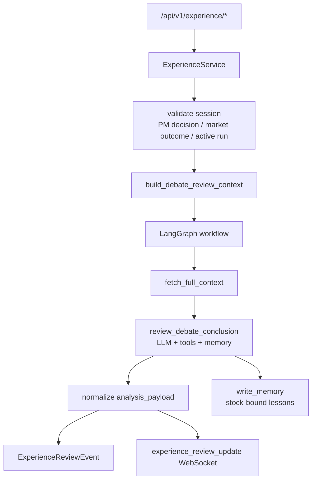
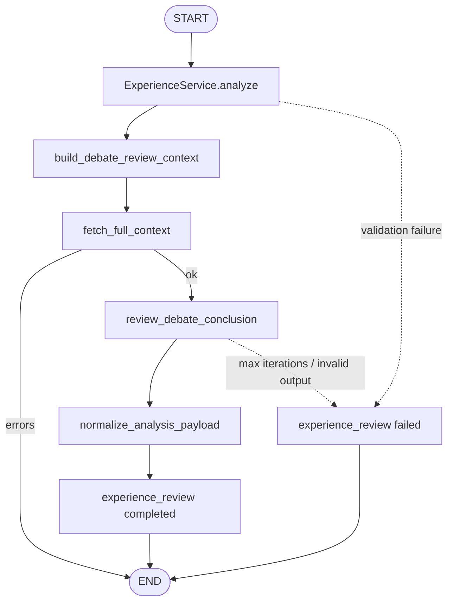

# Experience Review System 设计文档

`experience` 是单股 AI 辩论后的后验复盘系统。它不重新选股，也不重新跑普通单股分析；它把已经产生 PM 决策的 debate session 与决策后的真实市场表现放在一起，判断原始结论是否正确，解释涨跌主因，并把可复用经验写回长期记忆。

本文按“先总后分”组织：先说明模块定位、总体架构和复盘数据流，再展开发起条件、工作流、市场结果口径、LLM 复盘、记忆写入和前端契约。

## 1. 总体设计

### 1.1 设计目标

- 后验检验：用 PM 决策后的价格路径、回撤和相对收益验证原始结论。
- 主因归因：区分真正驱动涨跌的因素、被证伪信号和噪音信号。
- 流程改进：识别 debate 流程中的遗漏、误判、仓位纪律和卖出设计问题。
- 经验沉淀：把可复用交易规则、失败教训和流程改进写入长期记忆。
- 可追踪：每个 review run 的事件、工具调用和最终结果都可查询。
- 用户隔离：复盘只能访问当前用户自己的 session 和股票绑定记忆。

### 1.2 总体架构

### 1.3 核心文件

| 文件 | 职责 |
| --- | --- |
| [`api.py`](./api.py) | `/api/v1/experience/*` 接口入口。 |
| [`service.py`](./service.py) | 发起校验、复盘上下文构建、事件持久化、结果查询、删除和中断恢复。 |
| [`workflow.py`](./workflow.py) | LangGraph 复盘工作流、LLM 工具循环、结构化输出和记忆写入约束。 |
| [`schemas.py`](./schemas.py) | 请求、复盘结果、事件和 run 列表响应结构。 |
| [`experience_review_event.py`](../../models/experience_review_event.py) | 复盘事件表模型。 |
| [`experience_review_scheduler.py`](../../tasks/experience_review_scheduler.py) | 盘后自动扫描可复盘 session 并发起经验复盘。 |

## 2. 端到端流程

### 2.1 API 入口

API 挂载在 `/api/v1/experience`：

- `POST /analyze`
- `GET /debate-sessions`
- `GET /review-events/{session_id}`
- `GET /review-runs`
- `GET /review-run-events/{review_run_id}`
- `GET /review-run-result/{review_run_id}`
- `DELETE /review-runs/{review_run_id}`
- `DELETE /review-runs`

前端入口是 `/experience` 页面。运行中事件通过 `experience_review_update` WebSocket 推送。

后台入口是 `ExperienceReviewScheduler`。自动复盘默认关闭，可在系统设置页开启并配置执行时间、单次最大任务数
和候选扫描数量。默认执行时间为每天 18:30（Asia/Shanghai）。

### 2.2 发起条件

发起复盘只需要传：

- `session_id`

后端校验：

1. session 属于当前用户。
2. session 已有 `DebateMessage`。
3. session 已有最新 PM 决策。
4. 同一 session 没有运行中的复盘 run。
5. PM 决策后能构造市场结果摘要。
6. 运行中的旧 run 超过 `STALE_REVIEW_TIMEOUT = 2h` 会先标记失败。

自动调度额外要求：

1. session 状态为 `completed`。
2. PM 决策日开始至少有 6 条日 K，满足 5D 自动复盘的最小数据要求。
3. 自动调度按 `5d`、`20d`、`60d` 分别判断是否达到数据要求，并跳过已有事件占用的周期。
4. 单次扫描最多发起配置允许的 run 数，默认 2 个，避免盘后集中消耗 LLM 资源。

### 2.3 工作流拓扑

LangGraph 内部只有两个节点：

- `fetch_full_context`
- `review_debate_conclusion`

复杂度主要在 service 侧的上下文构建和 workflow 侧的 LLM 工具循环。

## 3. 核心数据设计

### 3.1 `debate_review_context`

`service.py` 从数据库构造复盘上下文：

| 字段 | 含义 |
| --- | --- |
| `session` | 原始 debate session 信息。 |
| `pm_decision` | 最新 PM 决策、置信度、仓位、止损、价格区间和执行计划。 |
| `debate_timeline` | 各 Agent 报告按时间排序后的结论文本。 |
| `agent_position_summary` | 各角色最近几次 decision 摘要。 |
| `execution_summary` | 订单、成交、均价、费用和已实现盈亏摘要。 |
| `market_outcome_summary` | 决策后的股票表现、回撤、指数超额和行业相对表现。 |

### 3.2 工作流状态

`ExperienceWorkflowState` 在 LangGraph 节点间传递：

- `user_id`
- `session_id`
- `review_run_id`
- `stock_code`
- `stock_name`
- `industry`
- `style_bucket`
- `trading_frequency`
- `trading_strategy`
- `debate_review_context`
- `full_context`
- `analysis_payload`
- `tool_trace`
- `review_events`
- `event_callback`
- `errors`

### 3.3 事件表

`ExperienceReviewEvent` 是复盘 run 的唯一持久化主线：

- `event_id`
- `review_run_id`
- `session_id`
- `user_id`
- `event_type`
- `stage`
- `status`
- `message_key`
- `message_params`
- `payload`
- `created_at`

run 列表和 run 结果都从同一个事件表聚合。删除 review run 本质上是删除该 run 的事件。

## 4. 分模块设计

### 4.1 Service

`ExperienceService` 负责非 LLM 逻辑：

- 校验发起条件。
- 防止同一 session 并发复盘。
- 清理重启中断或超时 stale run。
- 构造 `debate_review_context`。
- 持久化 started / completed / failed / tool_call 事件。
- 推送 WebSocket 更新。
- 归一化 `analysis_payload`。
- 查询 run、event、result。
- 删除 run。

Service 不负责 prompt 编写和工具调用循环，这些在 `workflow.py` 中。

### 4.2 Market Outcome

市场结果从 PM 决策时间开始读取目标股票日 K：

- 决策日价格。
- 5 日、20 日、60 日收益。
- 20 日、60 日最大回撤。
- 相对沪深 300 的 20 日超额收益。
- 相同行业样本下的 20 日相对收益。
- 前 20 个交易日的收盘、最高、最低价样本。

这些字段是复盘的事实基准。工具拿到的当前信息只能补充解释，不能覆盖输入里的历史事实。

### 4.3 Workflow

`workflow.py` 定义两个节点。

`fetch_full_context`：

- 提取 session、PM 决策、辩论 timeline、执行摘要和市场结果。
- 推送 `fetch_context completed` 事件。
- 失败时写入 `errors`，后续节点不执行。

`review_debate_conclusion`：

- 构造复盘 prompt。
- 绑定普通工具、记忆工具和 Skills loader 工具。
- 循环调用 LLM 和工具。
- 记录工具调用 trace。
- 要求最终输出符合 `ExperienceReviewOutput`。
- 要求最终 JSON 前必须调用 `write_memory`。
- 结构化输出失败后做 JSON-only retry。

### 4.4 LLM 复盘约束

复盘 LLM 必须围绕后验市场结果工作：

- 判断原始 PM 结论是否正确。
- 找出决策后涨跌的 1-3 个主导因素。
- 区分被市场验证、被市场证伪和噪音信号。
- 多维检查政策、行业、宏观、业绩、估值、资金、情绪、事件、商品价格、利率汇率。
- 输出可执行的买卖规则和 debate 流程改进规则。
- 不能把工具返回的当前信息当作决策时点历史事实。

执行参数：

- `EXPERIENCE_REVIEW_MAX_ITERATIONS = 50`
- `EXPERIENCE_REVIEW_FINAL_RETRY_LIMIT = 3`

### 4.5 Memory

复盘阶段使用 `build_memory_tools(...)` 挂载记忆工具，状态中注入：

- `agent_role = AGENT_NAME_PORTFOLIO_MANAGER`
- `user_id`
- `stock_code`
- `session_id`
- `trading_strategy`
- `trading_frequency`

记忆写入约束：

- 必须调用 `write_memory` 后才能返回最终 JSON。
- 只支持当前股票绑定记忆。
- 不允许手动传入其他 `stock_code`。
- 写入内容必须覆盖对象、实际结果、主导驱动、被验证信号、被证伪信号、可复用规则和失效边界。
- 不写普通背景信息或流水账。

## 5. 输出契约

最终 `analysis_payload` 来自 `ExperienceReviewOutput`，并经过 service 归一化。

核心字段：

- `thesis_summary`
- `recommended_action`
- `confidence_score`
- `risk_flags`
- `memory_evidence_used`
- `similar_success_patterns`
- `similar_failure_patterns`
- `lessons_applied`
- `market_experience_summary`
- `dominant_drivers`
- `rejected_drivers`
- `driver_dimension_review`
- `buy_sell_rules`
- `internet_evidence_used`
- `debate_correctness`
- `correctness_score`
- `correctness_reasoning`
- `debate_process_issues`
- `optimization_directions`
- `improved_debate_rules`
- `revised_target_position`
- `revised_stop_loss`
- `reviewed_pm_decision`
- `original_pm_decision`
- `original_target_position`
- `written_memories`
- `tool_invocation_summary`

重要口径：

- `market_experience_summary` 必须是可复用经验，不是普通摘要。
- `buy_sell_rules` 必须写成“触发条件 -> 动作 -> 原因”形式。
- `debate_correctness` 只能是 `correct / partially_correct / incorrect / inconclusive`。
- `recommended_action` 只能是 `avoid / watch / buy / add / hold / reduce / sell`。

## 6. 可观测性

运行中会写入并推送：

- `experience_review started`
- `fetch_context completed`
- `tool_call running`
- `experience_review completed`
- `experience_review failed`

关键 payload：

- `review_run_id`
- `stock_code`
- `stock_name`
- `tool_trace`
- `recommended_action`
- `debate_correctness`
- `result`
- `error`

应用启动时会调用 `cleanup_interrupted_review_runs()`，把仍处于 `started / running` 的旧 run 标记为 failed。查询列表时也会清理超过 2 小时的 stale run。

## 7. 前端契约

前端消费：

- `GET /debate-sessions`：可复盘 session 列表，只返回有 PM 决策的 session。
- `GET /review-events/{session_id}`：某个 debate session 最新复盘事件。
- `GET /review-runs`：当前用户所有复盘 run。
- `GET /review-run-events/{review_run_id}`：指定 run 的事件流。
- `GET /review-run-result/{review_run_id}`：指定 run 的最终结果。

前端应以 `review_run_id` 区分不同复盘 run，以 `stage/status/message_key/message_params` 渲染时间线。

## 8. 扩展规则

### 8.1 修改市场结果口径

需要同步：

1. `_build_market_outcome_summary()`。
2. 复盘 prompt 中的事实口径说明。
3. `ExperienceReviewOutput` 中相关字段。
4. 前端结果页展示。
5. 测试用例。

### 8.2 新增输出字段

需要同步：

1. `ExperienceReviewOutput`。
2. `_normalize_analysis_payload()`。
3. `ExperienceAnalyzeResponse` 或结果页 schema。
4. completed event payload。
5. 前端消费逻辑。

### 8.3 修改记忆策略

必须保持：

- 不绕过 `write_memory` 要求。
- 不写通用记忆，除非后端记忆工具和产品逻辑明确支持。
- 记忆不能覆盖市场结果事实。
- 写入内容必须是高信息密度经验，而不是复盘流水账。

## 9. 当前边界

- 只能复盘已有 PM 结论的 debate session。
- 必须有决策后的 K 线样本，否则拒绝复盘。
- 不重新跑选股、普通单股分析或 PM 决策。
- 复盘结果用于改进系统和模拟研究，不构成投资建议。
- Memory 可用性取决于后端 Memory 配置和服务健康状态。

## 10. 推荐阅读顺序

1. [`service.py`](./service.py)
2. [`workflow.py`](./workflow.py)
3. [`schemas.py`](./schemas.py)
4. [`api.py`](./api.py)
5. [`experience_review_event.py`](../../models/experience_review_event.py)
