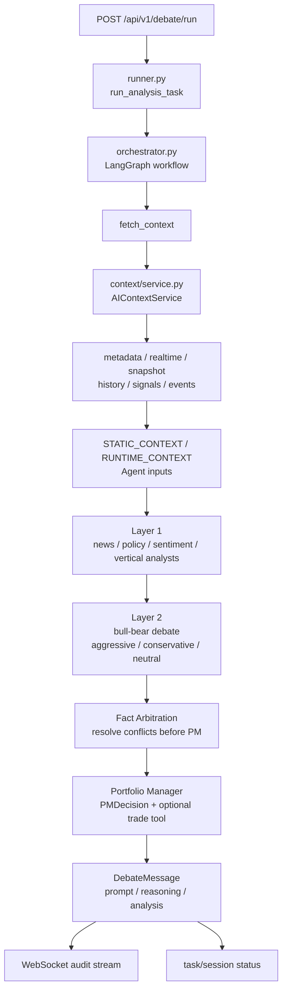
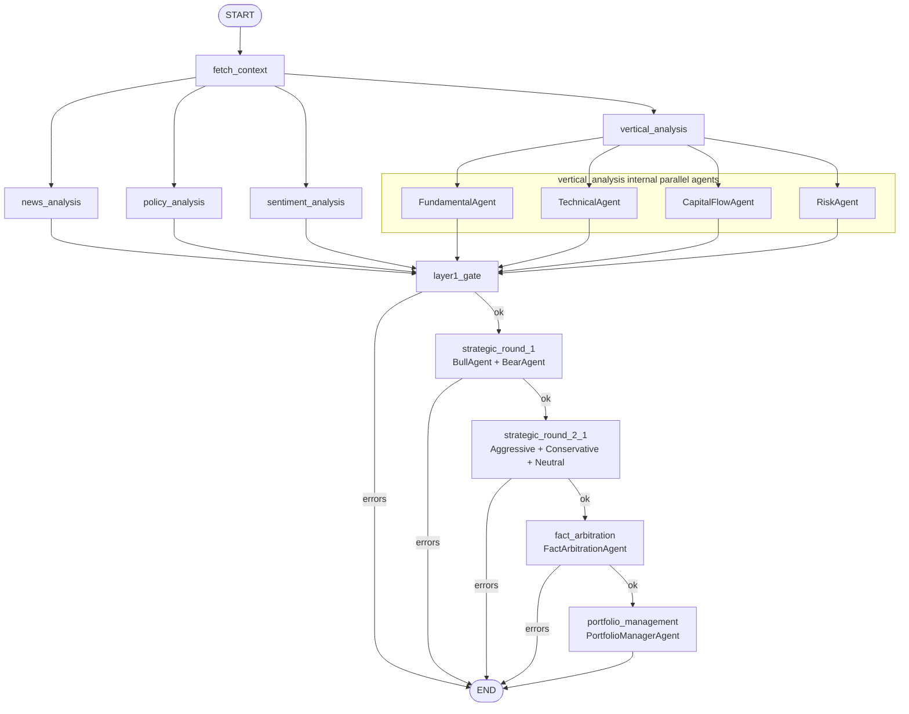

# LLM Debate Engine 设计文档

LLM 模型访问通过固定 `litellm` provider 进入 LiteLLM Proxy。Agent 工具循环仍使用 LangChain
`ChatOpenAI.bind_tools()`，模型别名使用 `backend/app/core/config.py` 中的 `LLM_MODEL`。

`llm_engine` 是单股 AI 投研决策引擎。它把一次股票分析拆成“事实上下文构建、第一层专业分析、第二层战略辩论、事实仲裁、PM 最终决策、审计持久化”几个阶段，避免模型直接给出不可追踪的买卖结论。

本文按“先总后分”组织：先说明系统定位、总体架构和核心数据流，再展开各模块的职责、契约和扩展边界。

## 1. 总体设计

### 1.1 设计目标

- 事实先行：先统一构建股票上下文，再让 Agent 基于同一事实面工作。
- 角色分工：不同 Agent 负责不同视角，减少单一模型视角偏差。
- 可审计：每个 Agent 的输入、输出、阶段、角色和置信度都写入数据库。
- 可控执行：PM 决策结构化输出，交易工具只在 PM 阶段暴露。
- 可扩展：上下文 provider、Agent、prompt、工具和图节点可以按边界独立演进。
- 用户隔离：记忆召回和写入绑定 `user_id + stock_code` scope。

### 1.2 总体架构



### 1.3 核心文件

| 文件 | 职责 |
| --- | --- |
| [`runner.py`](./runner.py) | 后台任务入口，维护 task/session 状态和 WebSocket 状态通知。 |
| [`orchestrator.py`](./orchestrator.py) | LangGraph 状态、节点、边、错误闸门和报告持久化。 |
| [`context/service.py`](./context/service.py) | 调度上下文 provider，产出统一 time-layer context。 |
| [`agents/base.py`](./agents/base.py) | Agent 通用执行器，封装 LLM、工具循环、摘要、校验、重试和上下文消息注入。 |
| [`agents/specialists.py`](./agents/specialists.py) | 新闻、政策、情绪、基本面、技术面、资金流、风控分析师。 |
| [`agents/strategic.py`](./agents/strategic.py) | 多头、空头、激进、保守、中性战略角色。 |
| [`agents/governance.py`](./agents/governance.py) | PM Agent 和交易工具封装。 |
| [`models.py`](./models.py) | 结构化输出模型，核心是 `PMDecision`。 |
| [`prompts/templates.py`](./prompts/templates.py) | 公共 system prompt 和角色 prompt 静态模板。 |
| [`../llm_routing.py`](../llm_routing.py) | Debate 并行开关和 research usage lane 路由。 |

## 2. 端到端流程

### 2.1 入口

调用方通过 `POST /api/v1/debate/run` 发起分析，请求需要包含：

- `session_id`
- `stock_code`
- `trading_frequency`
- `trading_strategy`

接口层完成 session 校验后创建后台任务，真正执行入口是 `run_analysis_task(...)`。

### 2.2 后台任务生命周期

`runner.py` 负责把一次运行包装成可追踪任务：

1. 将 task 状态更新为 `running`。
2. 通过 WebSocket 推送 `started`。
3. 调用 `create_analyst_workflow()` 构建 LangGraph。
4. 组装 `AnalystState` 初始状态。
5. 执行 `workflow.ainvoke(initial_state)`。
6. 根据 `errors` 决定 task/session 为 `completed` 或 `failed`。
7. 推送最终 WebSocket 状态。

任务执行期间不持有长生命周期数据库 session，数据库读写只在需要时短连接完成。

### 2.3 工作流拓扑



说明：

- `fetch_context` 成功后，第一层分析默认按 `DEBATE_AGENT_PARALLEL_ENABLED` 决定并行或串行。
- `vertical_analysis` 内部再并行运行基本面、技术面、资金流和风控 Agent。
- `layer1_gate` 是第一层汇合点；只要 `errors` 非空，后续阶段停止。
- 战略层先做多空对抗，再做激进、保守、中性三方交叉分析。
- `fact_arbitration` 在 PM 前裁决事实冲突、列出未解决事实和 PM 必须处理的反证。
- PM 阶段输出最终结构化决策，并可调用交易工具。

## 3. 核心数据设计

### 3.1 `AnalystState`

`AnalystState` 是 LangGraph 节点之间传递的共享状态，核心字段包括：

| 字段 | 含义 |
| --- | --- |
| `stock_code` | 目标股票。 |
| `trading_frequency` | 交易频率偏好。 |
| `trading_strategy` | 交易策略偏好。 |
| `session_id` | 当前分析会话，用于持久化和交易绑定。 |
| `user_id` | 从 session 反查得到，用于记忆隔离。 |
| `static_context` | 本次工作流固定输入，包括 `data`、`portfolio_info` 和可选盯盘触发信息。 |
| `context` | 统一股票上下文。 |
| `news_report / policy_report / sentiment_report` | 第一层横向分析报告。 |
| `vertical_reports` | 基本面、技术面、资金流、风控报告。 |
| `strategic_reports` | 战略辩论汇总报告。 |
| `strategic_round_2_1_reports` | 第二轮交叉分析报告。 |
| `fact_arbitration_report` | PM 前的事实仲裁报告。 |
| `pm_decision` | PM 最终结构化决策。 |
| `post_trade_reflection` | 预留的交易后反思状态字段。 |
| `errors` | 工作流错误累积字段，使用 `add` reducer 合并。 |

`static_context` 和 `context` 会分别作为 `STATIC_CONTEXT`、`RUNTIME_CONTEXT` 注入 Agent。`static_context` 存放本轮运行不应被节点覆盖的事实快照；`context` 存放节点间逐步追加的运行时材料，例如上游报告、辩论轮次和事实仲裁结果。

### 3.2 统一上下文

`AIContextService` 产出的 context 使用固定分层：

- `metadata`：目标股票、公司信息、生成时间、覆盖状态。
- `realtime`：实时行情、指标、资金和指数参考。
- `snapshot`：最新财务、估值、机构持仓、股东、龙虎榜等快照。
- `history`：K 线、资金趋势、财务趋势、互动问答等时间序列。
- `signals`：风险、资金、情绪等派生信号。
- `events`：财报、解禁、监管、分红、回购等事件。

Agent 不直接依赖数据库表结构，也不依赖旧式 context slice。当前统一通过 `STATIC_CONTEXT` 和 `RUNTIME_CONTEXT` 两条消息接收事实快照与阶段性运行材料。

### 3.3 PM 输出模型

PM 阶段必须输出 `PMDecision`：

- `decision`: `buy / sell / hold`
- `confidence_score`: 0 到 100
- `target_position`: 0 到 1
- `verdict_summary`
- `investment_plan`
- `price_range`
- `stop_loss`
- `risk_assessment`
- `execution_details`
- `report_markdown`

这是交易执行、审计展示和后续经验复盘的关键结构化契约。

## 4. 分模块设计

### 4.1 Runner

`runner.py` 不参与投研逻辑，只负责任务编排：

- 设置 request id，便于日志串联。
- 更新 task 状态。
- 更新 session 状态。
- 发送 WebSocket 状态。
- 调用 LangGraph 并保存最终 state。
- 捕获未处理异常并落到失败状态。

该层不应该放 Agent prompt、上下文构建或交易决策规则。

### 4.2 Orchestrator

`orchestrator.py` 是工作流编排层，负责：

- 定义 `AnalystState`。
- 定义 LangGraph 节点和边。
- 汇总第一层报告。
- 在节点失败时写入 `errors`。
- 控制错误闸门。
- 调用 `persist_agent_report(...)` 持久化报告。

编排层只决定“谁先运行、谁并行、失败后是否继续”，不负责具体 Agent 的系统 prompt 和工具实现。

### 4.3 Context

上下文模块分三层：

- provider：从行情、财务、事件、风险等来源构建分层数据。
- service：按 `AI_CONTEXT_SECTION_ORDER` 调度 provider 并组装完整 context。
- adapter：为每个 Agent 提供任务相关的最小输入。

上下文设计原则：

- 缺失数据用 `status` 表达，不用异常中断整个上下文。
- `metadata.coverage` 记录分层覆盖和 provider 错误。
- Agent 输入带 `_target_stock_code` 和 `_target_stock_name`，避免工具调用偏离目标。
- PM 的账户和目标股票持仓来自 `static_context.portfolio_info`；目标股票价格、仓位和盈亏优先复用 `portfolio.overview` 的动态估值口径。
- 盯盘自动触发 Debate 时，`runner.py` 会把 `trigger_reason` 和 `evidence_summary` 放入 `static_context.market_watch_trigger`。

### 4.4 Specialist Agents

第一层分析分为横向和纵向两类。

横向分析：

- `NewsAgent`：公司信息、行业位置、互动问答和新闻证据。
- `PolicyAgent`：政策、监管、行业政策和事件影响。
- `SentimentAgent`：行情情绪、热度、指数环境和互动信息。

纵向分析：

- `FundamentalAgent`：财务、估值、盈利预测、股东和行业位置。
- `TechnicalAgent`：K 线、技术指标、实时行情和指数参考。
- `CapitalFlowAgent`：主力资金、北向、融资融券、龙虎榜和板块资金。
- `RiskAgent`：质押、减持、解禁、股东变化和财务预警。

这些 Agent 当前输出 Markdown 报告，报告必须满足基础结构校验。

### 4.5 Strategic Agents

战略层把第一层分析转成投资观点冲突和风险折中。

第一轮：

- `BullAgent`：构造多头论证。
- `BearAgent`：构造空头论证。

第二轮：

- `AggressiveAgent`：偏机会和进攻。
- `ConservativeAgent`：偏风险和防守。
- `NeutralAgent`：平衡证据和条件。

事实仲裁：

- `FactArbitrationAgent`：综合第一层和战略层报告，裁决事实口径、标记未解决事实、列出 PM 必须回应的最强反证。

当前图中只有 `strategic_round_2_1` 和 `fact_arbitration`。`strategic_round_2_rebuttal(...)` 只是兼容历史调用，不再作为图节点写入新 stage。

### 4.6 Portfolio Manager

`PortfolioManagerAgent` 是治理层角色，输入包括：

- 实时价格信息。
- 新闻、政策、情绪报告。
- 垂直分析报告。
- 战略辩论报告。
- 事实仲裁报告。
- 当前账户和目标股票持仓。
- 同一用户、同一股票的上一条 PM 决策。
- 交易频率和交易策略偏好。

PM 的职责是输出最终 `PMDecision`。它可以调用专属 `execute_trading_order` 工具，该工具自动绑定当前 `session_id`，并要求 PM 提供 `stop_loss`。

## 5. Agent 执行机制

所有 Agent 共享 `BaseAgent.run(...)`：

1. 使用 provider 插件创建 chat model。
2. 拼接角色 system prompt、skills catalog、`STATIC_CONTEXT` 和 `RUNTIME_CONTEXT`。
3. 绑定工具进入工具调用循环。
4. 最多执行 `MAX_LLM_ITERATIONS = 60` 轮。
5. 达到上限后切换到无工具最终回答模式。
6. Markdown 报告检查标题、章节和段落数量。
7. 结构化输出用 Pydantic 解析，失败后最多做 `STRUCTURED_OUTPUT_RETRY_LIMIT = 3` 次 JSON-only 重试。

默认工具来自：

- `get_all_tools()`
- 记忆工具 `recall_memory / write_memory`
- Skills loader 工具

PM 额外追加交易工具。长工具输出由共享 summarizer 控制，目前主要针对 `search_news`。

LLM usage 记录通过 `get_research_usage_lane()` 写入 research lane，便于区分投研 Agent 调用和其他 LLM 调用。

## 6. 记忆设计

记忆工具由 `backend/app/ai/agentic/memory_tools.py` 构造，并挂载到支持记忆的 Agent。

记忆 scope：

```text
user:{user_id}:stock:{stock_code}
```

设计约束：

- 记忆只能作为经验和偏好增强，不是实时事实源。
- 召回和写入必须绑定当前用户和当前股票。
- Agent 不需要手动传 `stock_code`，由后端状态注入。
- 记忆不能覆盖行情、财务、新闻和政策等当前事实数据。

## 7. 持久化与前端契约

所有 Agent 报告通过 `persist_agent_report(...)` 写入 `DebateMessage`。

核心字段：

- `session_id`
- `stage`
- `round_number`
- `agent_name`
- `agent_role`
- `decision`
- `confidence`
- `reasoning`
- `prompt_input`
- `analysis`

存储规则：

- Markdown 报告：`reasoning = Markdown`，`analysis = {"markdown": ...}`。
- Pydantic 输出：`analysis = model_dump()`，并尽量提取 `decision / confidence / report_markdown`。

持久化成功后会通过 WebSocket 推送 `debate_msg.to_dict(exclude_prompt=True)`。如果没有活跃 WebSocket，实时消息可能丢失，但数据库记录仍可通过历史接口读取。

前端审计依赖 stage 名称分组：

- `news_analysis`
- `policy_analysis`
- `sentiment_analysis`
- `vertical_analysis`
- `strategic_round_1`
- `strategic_round_2_1`
- `fact_arbitration`
- `portfolio_management`

这些 stage 名称属于跨端契约，修改前需要同步前端展示和历史兼容逻辑。

## 8. 扩展规则

### 8.1 新增上下文数据

1. 新增或扩展 context provider。
2. 确保缺失数据用 `status` 表达。
3. 在节点 runtime context 中只追加对应 Agent 必需的上游报告和阶段材料。
4. 不让 Agent 直接读取数据库模型。

### 8.2 新增 Agent

1. 在 `agents/` 下继承 `BaseAgent`。
2. 在 `prompts/templates.py` 增加角色 prompt。
3. 在 `orchestrator.py` 增加节点、边和持久化 stage。
4. 明确输出是 Markdown 还是 Pydantic model。
5. 如需前端展示，先确认 stage 分组契约。

### 8.3 新增工具

1. 优先放在通用工具层，除非工具只属于 PM 或特定角色。
2. 工具参数必须明确、可校验。
3. 高风险工具必须在 Agent 层隐藏内部参数，例如 PM 交易工具隐藏 `session_id`。
4. 工具输出过长时需要进入摘要策略，避免污染模型上下文。

### 8.4 修改 PM 决策

`PMDecision` 是关键契约。新增字段需要同步：

- `models.py`
- PM prompt
- 持久化提取逻辑
- 前端审计页
- 交易执行和经验复盘使用方

## 9. 当前边界

- 大多数 Agent 仍输出 Markdown，只有 PM 强结构化。
- 工作流有错误闸门，但没有节点级自动重跑。
- 第一层和战略层是否并行由 `DEBATE_AGENT_PARALLEL_ENABLED` 控制；关闭后第一层按新闻、政策、情绪、纵向分析顺序串行。
- `strategic_round_2_2` 已不在当前图中。
- PM 工具面向模拟交易，真实券商接口、成交约束和生产风控不属于当前模块。
- 记忆召回不能替代当前事实数据。

## 10. 推荐阅读顺序

1. [`orchestrator.py`](./orchestrator.py)
2. [`runner.py`](./runner.py)
3. [`context/service.py`](./context/service.py)
4. [`agents/base.py`](./agents/base.py)
5. [`agents/specialists.py`](./agents/specialists.py)
6. [`agents/strategic.py`](./agents/strategic.py)
7. [`agents/governance.py`](./agents/governance.py)
8. [`models.py`](./models.py)
9. [`prompts/templates.py`](./prompts/templates.py)
