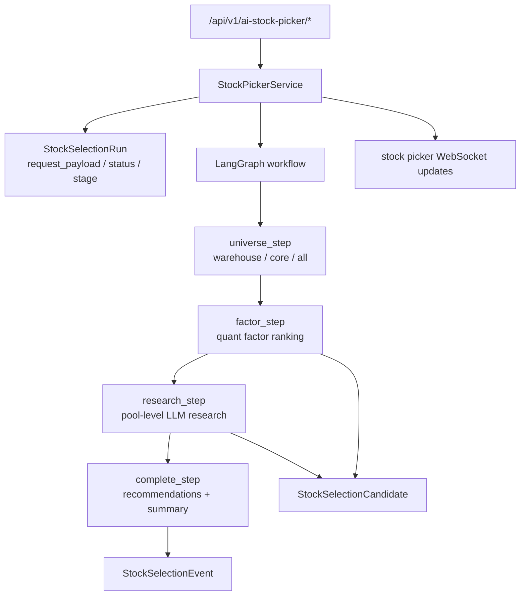
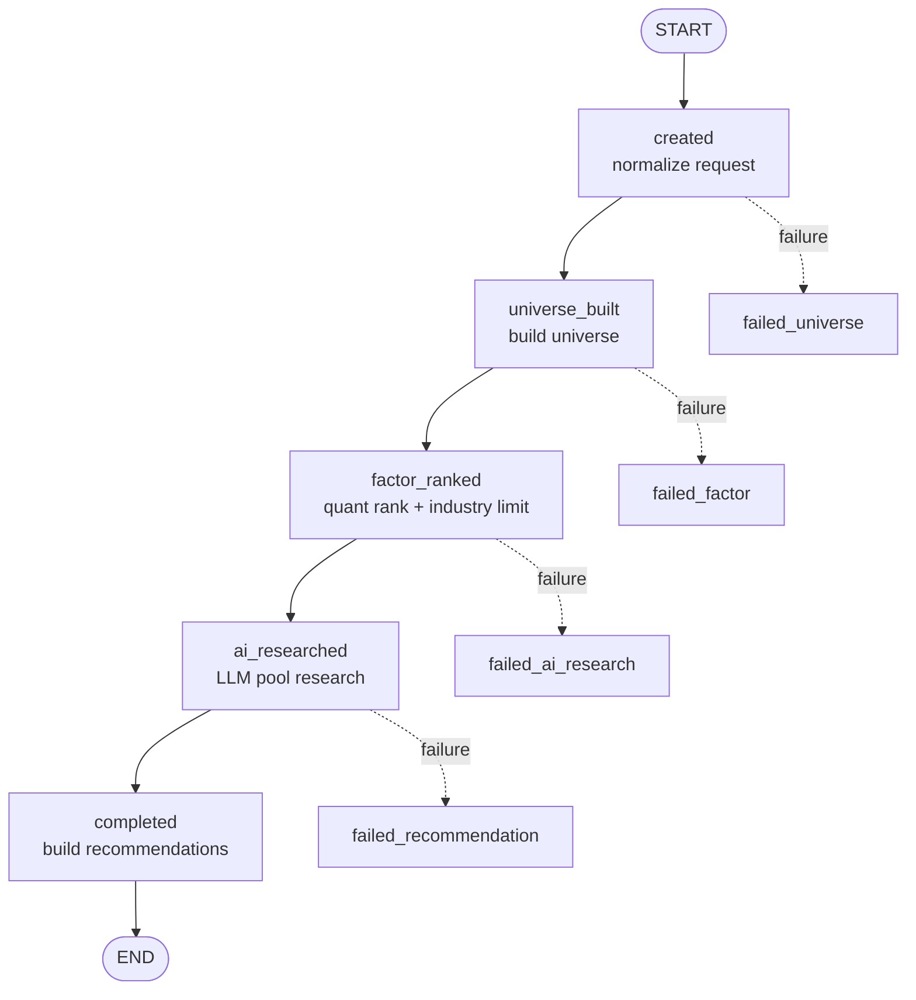

# AI Stock Picker 设计文档

`stock_picker` 是面向一批股票的 AI 智能选股引擎。它不做单股深度辩论，也不负责下单；它负责把用户选择的股票来源、风格和约束转换成一条可追踪的选股任务，最终输出推荐股票、备选股票和风险摘要。

本文按“先总后分”组织：先说明模块定位、总体架构和数据流，再展开工作流、数据模型、LLM 研究、推荐生成和扩展边界。

## 1. 总体设计

### 1.1 设计目标

- 先压缩候选：用确定性规则和量化辅助分先缩小股票池。
- 整池研究：LLM 一次性比较候选池，不把候选拆成逐股孤立任务。
- 证据约束：LLM 必须先调用证据工具，再输出结构化 JSON。
- 可追踪：run、event、candidate 都落库，前端可查看阶段和候选变化。
- 可配置：用户可配置来源、风格、推荐数量、候选上限、行业白名单和同行业上限。
- 边界清晰：只生成选股推荐，不构建持仓组合，不执行交易。

### 1.2 总体架构



### 1.3 核心文件

| 文件 | 职责 |
| --- | --- |
| [`api.py`](./api.py) | FastAPI 入口，创建任务、查询 run/events/candidates/result、删除任务。 |
| [`service.py`](./service.py) | 核心服务、LangGraph 工作流、候选池构建、因子初排、LLM 研究和推荐生成。 |
| [`schemas.py`](./schemas.py) | 请求、响应和结果 payload 的 Pydantic schema。 |
| [`models.py`](./models.py) | `stock_picker` schema 下的 run、event、candidate 表。 |
| [`universe.py`](./universe.py) | A 股基础过滤条件。 |

## 2. 端到端流程

### 2.1 API 入口

创建任务：

- `POST /api/v1/ai-stock-picker/runs`

查询与管理：

- `GET /api/v1/ai-stock-picker/industries`
- `GET /api/v1/ai-stock-picker/runs`
- `GET /api/v1/ai-stock-picker/runs/{run_id}`
- `GET /api/v1/ai-stock-picker/runs/{run_id}/events`
- `GET /api/v1/ai-stock-picker/runs/{run_id}/candidates`
- `GET /api/v1/ai-stock-picker/runs/{run_id}/result`
- `DELETE /api/v1/ai-stock-picker/runs/{run_id}`
- `DELETE /api/v1/ai-stock-picker/runs`

每个用户同一时间只能有一个未完成任务，避免多个长任务争用资源。

### 2.2 工作流拓扑



阶段说明：

- `created`：创建 run，保存规范化请求到 `request_payload`。
- `universe_built`：根据 `scope` 和行业白名单生成股票池。
- `factor_ranked`：计算量化辅助分，应用同行业数量限制，截断到 `factor_candidate_limit`。
- `ai_researched`：截断到 `research_candidate_limit`，让 LLM 对候选池做整体比较研究。
- `completed`：按 AI 判断和综合分生成最终推荐，写入 summary。

## 3. 核心数据设计

### 3.1 请求参数

`StockPickerRunCreate` 支持：

| 字段 | 含义 |
| --- | --- |
| `scope` | 股票来源：`warehouse / core / all`。 |
| `style` | 风格：`balanced / momentum / value / growth / defensive`。 |
| `recommendation_count` | 最终推荐数量，范围 `4..8`。 |
| `risk_level` | 风险偏好：`low / medium / high`。 |
| `factor_candidate_limit` | 因子初排保留数量，可为空使用默认值。 |
| `research_candidate_limit` | 进入 LLM 深研的数量，可为空使用默认值。 |
| `allowed_industries` | 行业白名单。 |
| `same_industry_limit` | 最终和中间候选中同一行业最多数量。 |

参数关系：

- `recommendation_count <= research_candidate_limit <= factor_candidate_limit`
- `same_industry_limit <= recommendation_count`
- `factor_candidate_limit` 不能超过来源上限。
- `research_candidate_limit` 不能超过来源上限。
- `allowed_industries` 必须来自 `GET /industries` 返回值。

### 3.2 默认候选规模

系统按 `scope + style` 计算默认值：

| scope | balanced/value/defensive | momentum/growth |
| --- | ---: | ---: |
| `warehouse` factor | 10 | 12 |
| `core` factor | 16 | 20 |
| `all` factor | 20 | 24 |
| `warehouse` research | 6 | 8 |
| `core` research | 8 | 10 |
| `all` research | 10 | 12 |

硬上限：

- `factor_candidate_limit`: `warehouse <= 20`，`core <= 30`，`all <= 40`
- `research_candidate_limit`: `warehouse <= 12`，`core <= 15`，`all <= 18`
- `same_industry_limit`: 默认 `3`

### 3.3 数据表

| 表 | 职责 |
| --- | --- |
| `stock_picker.stock_selection_runs` | 记录任务配置、状态、阶段、summary 和错误。 |
| `stock_picker.stock_selection_events` | 记录阶段事件，支持前端时间线和 WebSocket 推送。 |
| `stock_picker.stock_selection_candidates` | 记录候选股票的因子分、AI 分、综合分、决策和研究 payload。 |

配置类运行参数不新增数据库列，统一存放在 `StockSelectionRun.request_payload`，对外返回时由 `serialize_run_summary()` 展开。

## 4. 分模块设计

### 4.1 Universe

股票来源：

- `warehouse`：用户自选仓库中的活跃股票。
- `core`：核心指数成分股。
- `all`：全量符合基础条件的 A 股。

基础过滤由 `get_basic_stock_filter_conds()` 提供：

- 排除 ST。
- 排除退市名称。
- 市场限定为主板、中小板、创业板、科创板。
- 上市满 180 天。
- 股票状态为上市。

行业白名单在这一阶段直接过滤。

### 4.2 Factor Ranking

因子初排使用最新估值、日线和技术指标，计算 `quant_support`：

- `style_fit_score`
- `liquidity_score`
- `risk_penalty`
- `final_quant_score`

不同风格使用不同侧重点：

- `momentum`：技术动量。
- `value`：低估值和股息。
- `growth`：成长弹性和动量。
- `defensive`：股息、市值和稳定性。
- `balanced`：技术、稳定性和估值平衡。

数据完整率低于 `FACTOR_MIN_COMPLETENESS_RATIO = 0.8` 时直接失败，避免用残缺因子硬选。

### 4.3 LLM Research

研究阶段是整池研究：

- 输入为前 `research_candidate_limit` 个候选的量化摘要。
- LLM 必须先调用证据工具。
- loader 工具不算证据工具。
- `run_skill_script` 算证据工具。
- 未调用证据工具就输出 JSON，会被拒绝并要求补证据。
- 工具输出过长时使用共享 summarizer 压缩。
- 最终输出必须通过 `StockResearchOutput` 校验。

研究输出：

- `methodology_summary`
- `comparative_view`
- `research[]`
  - `stock_code`
  - `ai_score`
  - `thesis`
  - `catalysts`
  - `risks`
  - `style_fit_explanation`
  - `holding_horizon`
  - `decision`: `keep / watch / drop`

LLM 工具调用循环当前最多 50 轮。

### 4.4 Score Merge

研究结果归一化后写回候选：

```text
final_score = ai_score * AI_PRIMARY_WEIGHT + factor_score * FACTOR_AUX_WEIGHT
```

当前权重：

- `AI_PRIMARY_WEIGHT = 0.75`
- `FACTOR_AUX_WEIGHT = 0.25`

没有进入深研、或深研后未保留的候选会标记为 `drop`，并写入淘汰原因。

### 4.5 Recommendation

推荐生成规则：

1. 按 `decision` 优先级排序：`keep` 优先于 `watch`，`drop` 不进入推荐。
2. 同一 decision 内按 `final_score` 降序。
3. 再次应用 `same_industry_limit`。
4. 必须凑满 `recommendation_count`，否则任务失败。
5. 写入 `recommended_stock_codes`、`selection_logic` 和风险摘要。

输出的是推荐股票，不是持仓组合。

## 5. 可观测性

每个阶段都会写入 `StockSelectionEvent`，并通过 WebSocket 推送：

- `run_created`
- `universe_ready`
- `factor_ranked`
- `ai_researched`
- `recommendations_ready`
- `completed`
- `failed`

常见 payload 字段：

- `count`
- `factor_candidate_count`
- `factor_candidate_limit`
- `research_candidate_count`
- `same_industry_limit`
- `allowed_industries`
- `recommended_stock_codes`

应用重启后，未完成任务会被标记为失败，避免任务长期停在 `running`。

## 6. 前端契约

前端直接消费：

- run summary：任务状态、阶段和配置。
- events：阶段时间线。
- candidates：候选池、分数、决策和淘汰原因。
- result：推荐、备选和风险摘要。
- industries：行业多选枚举。

行业枚举来自 `data.stock_basic.industry`，规则是非空、去重、排序。前端不应硬编码行业列表。

## 7. 扩展规则

### 7.1 新增股票来源

1. 扩展 `StockPickerRunCreate.scope` 约束。
2. 扩展 `StockSelectionRun` 数据库 check constraint。
3. 扩展 `_build_universe()`。
4. 增加默认候选规模和硬上限。
5. 补充接口和服务层测试。

### 7.2 新增选股风格

1. 扩展 `style` schema 和数据库 check constraint。
2. 更新 `STYLE_LABELS`。
3. 更新默认候选规模。
4. 修改 `_compute_quant_support()` 风格逻辑。
5. 更新 LLM prompt 中的风格说明。

### 7.3 修改推荐结构

推荐结果由 `build_result()` 和 `StockPickerResultResponse` 对外暴露。新增字段需要同步：

- `schemas.py`
- `service.py`
- 前端结果页
- 候选表 `research_payload` 的生成逻辑
- 测试用例

### 7.4 修改 LLM 研究规则

注意保持以下约束：

- 不能绕过证据工具要求。
- 不能把整池研究退化成逐股硬编码流程。
- 不能把 loader-only 工具算作证据工具。
- 结构化输出仍必须由 Pydantic 校验。

## 8. 当前边界

- 选股模块不下单、不改仓、不生成组合权重。
- 风险偏好当前主要存储和展示，后续可继续接入评分和 prompt。
- LLM 研究失败会导致任务失败，不做静默降级推荐。
- 因子模型是辅助排序，不是独立量化策略。
- 每个用户同一时间只允许一个未完成 run。

## 9. 推荐阅读顺序

1. [`service.py`](./service.py)
2. [`schemas.py`](./schemas.py)
3. [`models.py`](./models.py)
4. [`api.py`](./api.py)
5. [`universe.py`](./universe.py)
