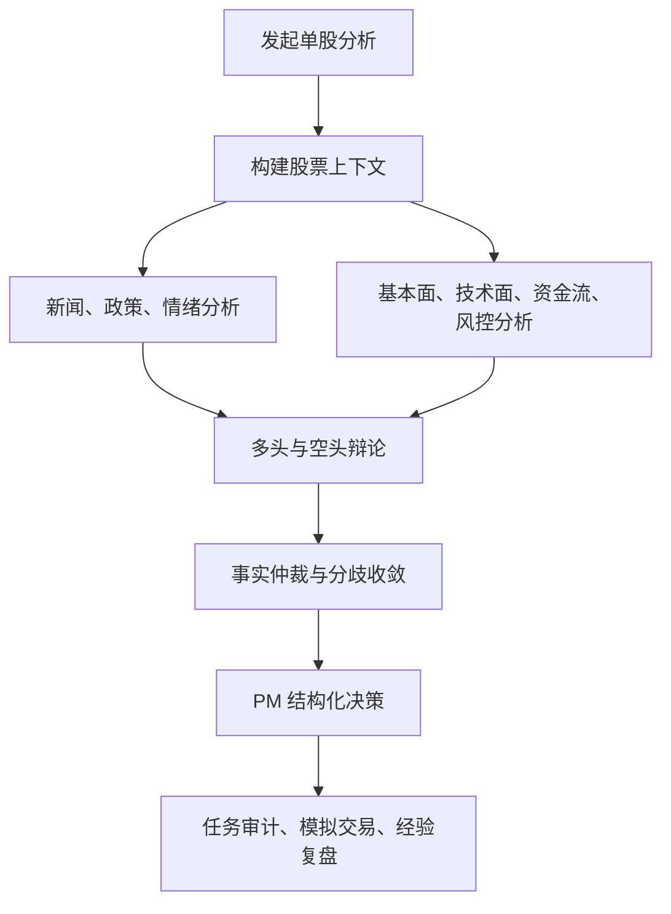

# AI 多智能体投研决策：让 AI 组成一支专业投委会

仓库地址：[https://github.com/MarvekG/BestAITrader](https://github.com/MarvekG/BestAITrader)

> 天枢智投不是让一个模型直接给出买卖判断，而是把投研任务拆解为事实构建、专业分析、战略辩论、事实仲裁和 PM 决策，让 AI 像一支可审计的投委会一样工作。

## 为什么需要这个功能

传统 AI 股票分析经常把复杂投研压缩成一次问答。用户输入股票代码，模型输出一段看似完整的分析，但很难知道它参考了哪些事实、是否覆盖了关键风险、有没有认真处理多空分歧，也很难判断结论是基于证据推导，还是语言模型对常见观点的重新组织。

真实投研不是单点预测，而是证据组织、观点对抗和风险约束的组合过程。基本面、技术面、资金流、政策、新闻、市场情绪和风控纪律都会影响结论。任何一个视角过强或过弱，都可能让判断失衡；任何一个关键假设没有被挑战，都可能让决策过度自信。

因此，天枢智投把 AI 投研设计成一场可追踪的投委会，而不是一次不可复核的聊天回答。它强调的不是“模型说了什么”，而是“结论如何从数据、角色分工、辩论和 PM 治理中形成”。

## 这个功能是什么

AI 多智能体投研决策是天枢智投的核心 AI 工作流。它围绕单只股票构建统一上下文，让新闻、政策、情绪、基本面、技术面、资金流、风控、多头、空头和 PM 等角色依次参与，最终形成结构化投资决策。

这个功能的定位不是“生成一篇分析报告”，而是搭建一条可运行的 AI 投研治理链路。数据工程负责提供事实，Agent 工具负责补全证据，多智能体负责分工和制衡，PM 负责把分歧收敛成可执行决策，实时任务负责审计过程，模拟交易和经验复盘负责验证结果。

它连接数据工程、Agent 工具、实时任务、模拟交易和经验复盘，是从“分析”走向“执行与学习”的主干链路，也是天枢智投区别于普通 LLM 股票问答工具的核心能力。

## 它如何工作

1. 用户从前端或 API 发起单股分析任务，系统创建可追踪的异步任务和分析会话。
2. 系统构建行情、财务、新闻、政策、资金流、持仓和历史上下文，确保 Agent 基于同一事实材料工作。
3. 新闻、政策、情绪、基本面、技术面、资金流和风控等专业 Agent 分别产出分析，降低单一模型视角偏差。
4. 战略角色进入多空辩论，显式暴露乐观假设、悲观假设、反证材料和关键不确定性。
5. 事实仲裁环节整理冲突信息，避免 PM 在未处理分歧的情况下直接输出结论。
6. PM 汇总事实、分歧和风险，输出包含动作、信心、仓位、止损和交易参数的结构化决策。
7. 过程和结果写入任务、消息、交易和复盘链路，为后续审计和经验沉淀提供依据。

## 核心价值

- 专业分工：系统把单次问答拆成事实准备、垂直分析、战略辩论、事实仲裁和 PM 决策，更接近真实投委会流程。
- 多角色制衡：多头、空头、风控和 PM 不承担同一种职责，能主动暴露反证、分歧和风险，降低单一视角过度自信。
- 过程可审计：每个 Agent 的阶段、角色、输出和最终结论都会被记录，用户可以回看结论是如何形成的。
- 决策可执行：PM 输出不只是观点，还包含动作、信心、仓位、风险和交易参数，可以进入模拟交易链路。
- 结果可复盘：结构化决策和完整过程记录可以在后续经验复盘中接受真实市场结果检验。

## 典型使用场景

- 单股深度分析
- 投研观点交叉验证
- AI 投委会演示
- 模拟交易前决策生成
- 持仓标的重新评估
- AI 决策过程审计

## 与普通方案有什么不同

| 常见做法 | 天枢智投做法 |
| --- | --- |
| 单模型一次性回答 | 多 Agent 分工、辩论、事实仲裁和 PM 决策 |
| 依赖模型记忆和泛化表达 | 基于行情、财务、新闻、政策、资金流和持仓上下文形成判断 |
| 只输出文字建议 | 输出动作、信心、仓位、风险和交易参数等结构化结果 |
| 结论难以回放 | session、message、task 和 WebSocket 事件可追踪 |
| 分析和执行断裂 | 决策可进入模拟交易、组合观察和经验复盘 |

## 使用边界

该功能用于研究、开发和模拟交易，不构成投资建议。AI 决策依赖数据质量、模型表现、上下文完整性和用户自己的风险判断，不保证预测准确，也不承诺收益。多智能体辩论能提升分析透明度和观点覆盖度，但不能消除市场不确定性。

## 总结

如果说普通 AI 股票分析解决的是“快速生成一段观点”，那么天枢智投的 AI 多智能体投研决策解决的是“让观点在专业分工、证据约束和可追踪流程中形成，并进入执行和复盘闭环”。

天枢智投不是让一个 AI 猜答案，而是让一支 AI 投委会共同形成决策。
