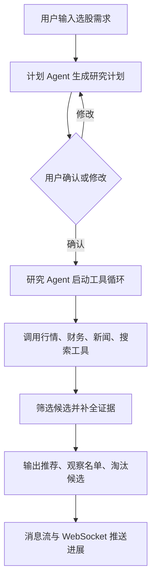

# 交互式 AI 深度选股：让选股从黑箱推荐变成可沟通研究

仓库地址：[https://github.com/MarvekG/BestAITrader](https://github.com/MarvekG/BestAITrader)

> 用户用自然语言描述选股目标，AI 先生成可确认的研究计划，再通过 Deep Research 工具循环补全证据，输出推荐、观察名单、淘汰候选和风险摘要。

## 1. 为什么需要这个功能

很多选股工具可以快速给出股票名单，但用户很难判断这些股票为什么入选。筛选过程是否合理、哪些候选被淘汰、证据是否充分、是否符合用户风险偏好，常常都藏在黑箱里。结果看似高效，但缺少研究路径、证据链和可修改空间。

真实选股通常不是一次性动作，而是连续研究。用户会不断调整行业范围、风格偏好、风险约束、财务指标、交易周期和排除条件。如果 AI 不能先和用户对齐研究计划，推荐名单就很难被信任，也难以沉淀为可复用的选股方法。

天枢智投希望把 AI 选股从“直接给答案”变成“共同做研究”：先明确问题，再确认路径，然后用工具补全证据，最后给出可解释的候选结果。

## 2. 这个功能是什么

交互式 AI 深度选股是面向自然语言选股需求的研究工作流。它先把用户意图转化为可确认的研究计划，再由研究 Agent 调用数据、搜索、新闻和分析工具，逐步形成证据化推荐。

这个功能强调“研究过程可协作”。用户不是把需求丢给 AI 后等待一个黑箱结果，而是可以在计划阶段修改研究方向，在研究过程中继续补充约束，在结果阶段查看推荐理由、证据缺口和风险摘要。

该功能只输出推荐、观察名单、淘汰候选和风险摘要，不直接构建持仓组合，也不执行交易，确保选股研究和交易执行之间保持清晰边界。

## 3. 它如何工作

1. 用户提交自然语言选股目标和基础约束，例如行业、风格、财务质量、风险偏好或交易周期。
2. 系统生成研究计划，说明筛选维度、数据需求、分析路径和潜在证据缺口。
3. 用户确认计划，或继续修改行业范围、排除条件、偏好权重和研究方向。
4. 研究 Agent 调用工具补全行情、财务、新闻、搜索和外部信息，并保留阶段状态。
5. 系统逐步比较候选标的，解释入选原因、淘汰原因和继续观察的理由。
6. 结果进入消息流，用户可继续追问、收窄范围或让 AI 补充新的研究证据。

## 4. 核心价值

- 计划先行：AI 不直接拍名单，而是先明确研究路径，让用户知道系统准备如何选股。
- 证据驱动：推荐结果来自工具调用和数据补全，用户可以看到入选理由、风险点和证据缺口。
- 人机协同：用户可以修改条件、继续追问和补充偏好，让选股过程更贴合真实研究。
- 结果分层：系统不仅给出推荐，还区分观察名单、淘汰候选和待补证据，便于后续持续跟踪。
- 过程沉淀：对话、计划、工具调用和阶段状态都会保留，方便复查和延展成长期选股方法。

## 5. 典型使用场景

- 主题投资筛选
- 行业机会挖掘
- 风格化股票池构建
- 中长期候选标的研究
- 按风险偏好筛选股票
- 对已有股票池做二次筛选

## 6. 与普通方案有什么不同

| 常见做法 | 天枢智投做法 |
| --- | --- |
| 输入一句话后直接给股票名单 | 先生成可确认研究计划 |
| 推荐理由模糊 | 推荐、观察、淘汰和证据缺口都有解释 |
| 一次性回答，难以继续调整 | 支持连续追问、约束补充和计划修订 |
| 选股和工具调用割裂 | 研究 Agent 在工具循环中补全证据 |
| 选股结果直接混同交易建议 | 只输出研究候选，不直接构建组合或执行交易 |

## 7. 使用边界

该功能用于研究辅助和模拟场景，不构成投资建议。选股结果不代表买卖指令，不保证未来收益。外部数据、新闻和搜索结果可能存在延迟、缺失或授权限制，用户应结合自身研究和风险偏好进行二次判断。

## 8. 总结

如果说普通 AI 选股解决的是“快速给出一个名单”，那么天枢智投的交互式 AI 深度选股解决的是“让用户看见研究计划、证据补全和候选筛选如何形成，并能持续参与调整”。

真正有价值的 AI 选股，不是给你一个神秘答案，而是让你看见答案如何一步步形成。
