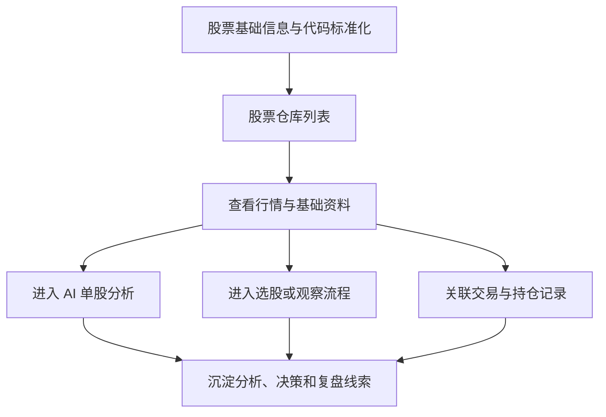

# 股票仓库：为每一只股票建立长期研究档案

仓库地址：[https://github.com/MarvekG/BestAITrader](https://github.com/MarvekG/BestAITrader)

> 股票仓库把股票基础信息、行情视图、AI 分析入口、交易观察和复盘线索集中到一个统一研究入口，让每只股票成为可长期经营的研究对象。

## 1. 为什么需要这个功能

日常投研中，股票信息经常分散在多个地方。行情在交易软件里，财务在数据网站里，新闻在资讯平台里，分析结论在聊天记录里，股票池又在表格里维护。信息越分散，越难形成长期研究资产，也越难让 AI 接上历史上下文。

对于 AI 投研来说，碎片化会直接影响上下文质量。每次重新输入股票代码、重新解释研究背景、重新拼接数据，会让分析成本变高，也让历史判断、交易结果和复盘经验难以复用。

股票仓库的目标，是把股票从一个孤立代码，变成系统内可以长期跟踪、反复分析、持续复盘的研究对象。

## 2. 这个功能是什么

股票仓库是天枢智投的标的中心和研究入口。它用于浏览股票基础信息、行情状态和相关投研入口，并连接 AI 单股分析、智能选股、模拟交易、组合观察和经验复盘。

它不是简单的列表页，而是每只股票的研究档案入口。围绕同一只股票，系统可以持续沉淀基础资料、分析结论、持仓线索、交易结果和复盘经验，让投研对象具备长期生命周期。

## 3. 它如何工作

1. 系统接入并标准化股票基础信息，统一代码、名称、市场和行业等关键标识。
2. 用户在股票仓库中浏览、检索、筛选和定位重点标的。
3. 用户查看行情、基础资料、数据覆盖状态和相关投研入口。
4. 用户从股票入口发起 AI 分析、选股研究、交易观察或复盘查询。
5. 后续分析、交易和复盘结果围绕同一标的持续沉淀，形成长期研究档案。

## 4. 核心价值

- 统一研究入口：用户不必在多个页面和外部系统之间切换，可以围绕同一只股票继续分析和跟踪。
- 长期档案沉淀：基础信息、AI 判断、交易记录和复盘经验可以围绕股票持续积累。
- 上下文更稳定：标准化股票代码和基础资料为后续 Agent 分析提供稳定输入，减少重复准备成本。
- 资产化管理：股票不再只是列表中的代码，而是可被长期维护、评估和复盘的研究资产。
- 连接完整闭环：股票仓库把数据、分析、交易和复盘连接起来，是长期投研链路的起点。

## 5. 典型使用场景

- 浏览 A 股基础信息
- 维护重点关注股票池
- 从股票入口发起 AI 分析
- 跟踪持仓标的变化
- 为复盘查找历史标的
- 团队共享研究对象列表

## 6. 与普通方案有什么不同

| 常见做法 | 天枢智投做法 |
| --- | --- |
| 股票只是行情列表里的代码 | 股票是可持续维护的研究对象 |
| 信息散落在多个系统 | 基础资料、行情和投研入口集中展示 |
| 分析记录难以接上历史 | 分析、交易和复盘围绕标的沉淀 |
| AI 每次从零开始 | 股票档案为 AI 提供稳定上下文 |
| 股票池只用于静态浏览 | 股票仓库连接 AI 分析、交易观察和复盘链路 |

## 7. 使用边界

股票仓库提供研究入口和基础信息组织能力，不直接给出买卖建议。页面展示依赖数据源完整性、字段覆盖和刷新状态，用户应结合数据质量判断信息可用性。

## 8. 总结

如果说普通股票列表解决的是“找到一只股票”，那么天枢智投的股票仓库解决的是“围绕一只股票持续建立研究档案，并把它连接到 AI 分析、交易和复盘闭环”。

让每一只股票都拥有自己的研究档案，让每一次分析都能接上历史上下文。
