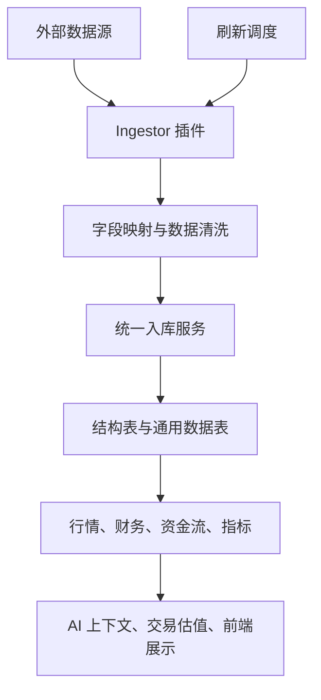

# 数据管理：AI 投研的上限，首先取决于数据底座

仓库地址：[https://github.com/MarvekG/BestAITrader](https://github.com/MarvekG/BestAITrader)

> 数据管理把外部 A 股数据接入、标准化、落库和刷新调度统一起来，为 AI、交易、组合和前端提供可复用、可审计的可信事实层。

## 为什么需要这个功能

AI 投研很容易被模型表现吸引，但真正决定分析质量的，往往是数据底座。如果行情、财务、资金流和公告数据来源不清、字段不统一、刷新不稳定，模型就只能在不可靠材料上生成看似合理的文字。没有可信数据，AI 结论再流畅，也很难进入专业流程。

很多系统的问题不是没有数据，而是每个功能都临时抓一份数据、各自清洗字段、各自解释缺失值。长期下来，口径不一致、错误难追踪、刷新成本高，AI 分析也难以复现，组合估值和复盘结果也容易出现语义偏差。

天枢智投把数据管理作为 AI 投研的基础设施，而不是附属页面。它的目标是让数据从“临时输入”升级为“系统级事实资产”。

## 这个功能是什么

数据管理是天枢智投的 A 股数据工程底座。它负责外部数据源接入、字段映射、DataFrame 标准化、去重 upsert、技术指标计算和刷新调度。

AI 分析、模拟交易、组合估值和前端数据页都应该从这里获取可信数据，而不是各自临时抓取和清洗。统一数据底座让不同模块共享同一套股票代码、日期、字段、缺失状态和指标语义。

它的优势不只是“能接数据”，而是把外部数据接入变成可维护、可扩展、可复用的工程链路。

## 它如何工作

1. 数据源通过 ingestor 插件接入系统，避免为每个来源新增独立采集框架。
2. 系统对字段、日期、股票代码、数值类型和 JSON 数据进行标准化。
3. 数据通过统一入库服务去重并写入结构表或通用数据表，减少重复 upsert 逻辑。
4. 调度器负责批量刷新和错峰执行，避免大数据任务阻塞普通请求。
5. 技术指标、资金流和派生信号进入 AI 上下文、组合估值和前端展示。
6. 外部源异常、字段缺失或刷新失败时保留状态，便于审计和排障。

## 核心价值

- 统一事实口径：不同业务模块共享同一套事实层，减少各自抓取、各自清洗带来的不一致。
- 工程化可维护：字段映射、标准化、去重入库和刷新调度都有固定边界，便于长期演进。
- 可扩展数据源：新数据源通过插件体系接入，避免新增平行采集框架。
- 支撑可信 AI：Agent 基于真实数据和明确上下文工作，而不是依赖模型记忆回答金融问题。
- 提升审计能力：缺失、异常和刷新状态可以被暴露，避免把不完整数据伪装成完整数据。

## 典型使用场景

- A 股基础资料接入
- 行情和财务数据刷新
- 资金流和指数数据维护
- AI 分析上下文构建
- 前端数据页展示
- 新数据源插件扩展

## 与普通方案有什么不同

| 常见做法 | 天枢智投做法 |
| --- | --- |
| 每个功能临时抓数据 | 统一数据接入、清洗和入库 |
| 字段口径分散 | 字段映射和标准化集中处理 |
| 大任务阻塞页面请求 | 使用调度和异步任务刷新 |
| 数据缺失被隐藏 | 保留错误或缺失状态，方便审计 |
| AI 直接依赖 prompt 里粘贴的数据 | AI context 从统一事实层构建 |

## 使用边界

数据管理只提供事实、指标和派生数据，不直接给出买卖建议。外部数据源的授权、可用性、延迟和完整性需要用户自行确认，系统不会替代数据合规审查，也不会保证第三方数据永久稳定可用。

## 总结

如果说模型决定了 AI 能如何推理，那么数据管理决定了 AI 基于什么事实推理。天枢智投先把可信事实层打牢，再让 Agent 在统一数据语义上完成投研判断、交易估值和经验复盘。

可信数据是 AI 投研的地基，天枢智投先把地基打牢，再让模型做判断。
