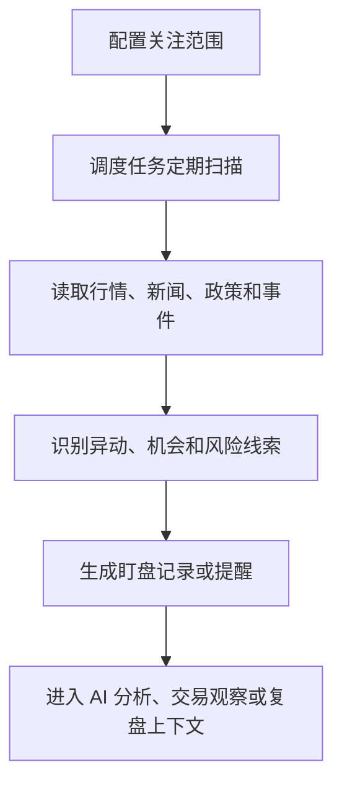

# 市场盯盘：让 AI 持续关注市场变化

仓库地址：[https://github.com/MarvekG/BestAITrader](https://github.com/MarvekG/BestAITrader)

> 市场盯盘把行情、新闻、政策、任务调度和 AI 上下文结合起来，帮助用户持续发现机会线索、风险变化和后续分析入口。

## 为什么需要这个功能

投资机会和风险不会只在用户提问时出现。行情异动、政策变化、突发新闻、资金流转向和行业轮动，经常发生在持续观察过程中。只做一次性分析，很容易错过后续变化，也无法把新信息及时接入已有判断。

传统工作方式依赖用户主动打开多个信息源，再手动判断哪些变化值得关注。这个过程耗时、分散，也难以和 AI 分析、交易决策、持仓复盘连接起来。用户看到的是信息流，但系统需要的是可进入工作流的结构化线索。

天枢智投的市场盯盘希望把被动查询变成主动观察，把分散事件变成可以被记录、追踪和复用的投研触发信号。

## 这个功能是什么

市场盯盘是面向持续观察场景的 AI 和任务能力。它围绕重点股票、市场线索和配置规则，跟踪行情、新闻、政策和相关事件，并把变化沉淀为后续分析、交易或复盘的输入。

它不是单独的信息流页面，而是连接数据、AI 工作流和任务调度的市场观察层。它的核心价值，是让市场变化不再停留在“看到了”，而是能进入“需要分析、需要交易观察、需要复盘验证”的系统流程。

## 它如何工作

1. 用户或系统配置需要关注的标的、主题、风险点和观察范围。
2. 调度任务按设定节奏读取行情数据、新闻事件、政策线索和相关市场信息。
3. 系统识别价格异动、消息催化、政策变化、风险暴露或观察价值提升的线索。
4. 重要变化被记录为可追踪的盯盘信息，并保留来源和状态。
5. 后续 AI 分析可以把这些变化纳入上下文，避免只基于静态数据判断。
6. 对持仓、观察名单和复盘候选，盯盘线索可以成为后续决策和审计依据。

## 核心价值

- 主动观察：系统帮助用户持续关注市场变化，而不是每次都从零开始提问。
- 线索结构化：行情、新闻、政策和事件不只是信息流，而是可进入 AI 上下文的观察记录。
- 风险更敏感：突发事件、价格异动和政策变化可以更早进入用户视野。
- 连接主流程：盯盘信息可以进入 AI 分析、交易观察和复盘上下文，避免信息孤岛。
- 支持长期跟踪：对于持仓和重点观察股票，系统可以持续积累近期变化线索。

## 典型使用场景

- 持仓标的持续观察
- 行业或主题异动跟踪
- 新闻和政策事件监控
- 交易前信息补全
- 风险预警辅助
- AI 分析任务触发

## 与普通方案有什么不同

| 常见做法 | 天枢智投做法 |
| --- | --- |
| 用户手动刷新多个信息源 | 系统通过任务持续扫描 |
| 信息流和分析割裂 | 盯盘线索进入 AI 上下文 |
| 只看到单点行情 | 结合行情、新闻、政策和事件 |
| 异动难以沉淀 | 记录可追踪的观察线索 |
| 盯盘只服务当下提醒 | 盯盘结果可进入交易观察和后续复盘 |

## 使用边界

市场盯盘用于辅助观察，不保证覆盖所有市场事件，也不构成投资建议。外部新闻、政策和行情源可能存在延迟、缺失或误差，用户应结合自身判断确认重要信息，尤其是突发事件和交易相关信息。

## 总结

如果说普通分析工具解决的是“你问一次，我答一次”，那么天枢智投的市场盯盘解决的是“让系统持续替你关注变化，并把线索带回投研、交易和复盘流程”。

市场不会等你提问，天枢智投让 AI 帮你持续盯住变化。
