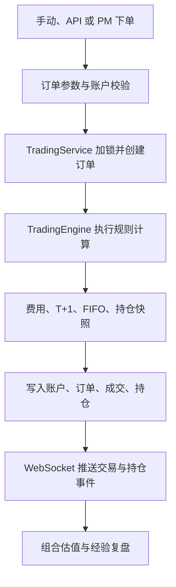

# 模拟交易与持仓账本：让 AI 决策进入真实交易逻辑

仓库地址：[https://github.com/MarvekG/BestAITrader](https://github.com/MarvekG/BestAITrader)

> 模拟交易与持仓账本把 AI 和手动订单统一纳入账户、订单、成交、持仓、费用、T+1 和 FIFO 规则中，让投研结论从文字建议进入可执行、可审计、可复盘的交易闭环。

## 1. 为什么需要这个功能

很多 AI 投研系统停留在“生成建议”。模型可以写出完整分析，也可以给出买入、卖出或观望结论，但这些结论如果不能进入账户、订单和持仓，就很难验证它们到底有没有价值。没有交易账本，AI 判断无法转化为资产变化，也无法被后续绩效和复盘检验。

真实交易不是一行文字。它涉及资金、价格、数量、手续费、可卖股数、持仓成本、止损纪律、账户一致性和后续盈亏。如果 AI 决策不经过这些规则，就无法形成可审计的交易闭环，也很容易把“看起来正确的建议”和“真正可执行的交易”混为一谈。

天枢智投用模拟交易与持仓账本，把 AI 决策从报告推进到账户逻辑中，让每一次模拟执行都有资金、仓位、成本和后续结果作为支撑。

## 2. 这个功能是什么

模拟交易与持仓账本是天枢智投的交易核心。手动下单、API 下单和 PM 智能体下单都必须进入统一交易服务和交易引擎，使用同一套账户、订单、成交和持仓口径。

系统支持 A 股 100 股一手、T+1 可卖、费用计算、FIFO 批次账本、持仓快照和止损字段，让模拟交易更接近真实交易管理。交易服务负责数据库一致性，交易引擎负责规则计算，二者分工明确，避免把复杂撮合逻辑散落在 API 或 AI 工具里。

这种设计让 AI 决策和人工交易处在同一套治理框架下：AI 不能绕过账户、风控和交易规则，人工交易也能被纳入相同的绩效与复盘体系。

## 3. 它如何工作

1. 订单来自前端、API 或 PM 专属交易工具，所有入口进入同一交易服务。
2. 系统校验用户、账户、股票代码、数量、价格、订单类型和止损参数。
3. 交易服务对账户和持仓进行一致性编排，创建订单并准备账户快照。
4. 交易引擎执行纯计算规则，包括资金校验、费用计算、A 股一手、T+1 和 FIFO 批次扣减。
5. 成交结果写入账户、订单、成交记录和持仓账本，保证数据库状态和引擎结果一致。
6. WebSocket 推送订单、成交和持仓变化，前端可以实时看到交易结果。
7. 持仓变化进入组合、绩效、风控和经验复盘链路，用于后续验证 AI 决策质量。

## 4. 核心价值

- 决策可落地：AI 结论不再只停留在文本里，而是可以进入模拟账户和持仓管理。
- 规则统一：手动、API 和 AI 下单共用同一套交易链路，避免不同入口产生不同口径。
- 账本专业化：FIFO 批次账本记录买入批次、成本、费用和可卖状态，支持后续盈亏与复盘分析。
- A 股约束明确：系统支持一手、T+1、费用和止损等关键规则，让模拟结果更具参考价值。
- 闭环验证：交易结果会影响组合和经验复盘，让系统能够用后续市场表现检验决策质量。

## 5. 典型使用场景

- AI 决策模拟执行
- 手动模拟下单
- 策略交易流程演练
- 持仓成本和盈亏跟踪
- A 股 T+1 规则验证
- 后验经验复盘输入

## 6. 与普通方案有什么不同

| 常见做法 | 天枢智投做法 |
| --- | --- |
| AI 只输出文字建议 | PM 决策可进入模拟交易 |
| 买卖记录简单流水化 | 使用订单、成交、账户和持仓账本 |
| 忽略 A 股交易细节 | 支持一手、T+1、费用和 FIFO |
| AI 和手动交易口径不同 | 所有入口统一进入 TradingService 和 TradingEngine |
| 交易结果和分析割裂 | 持仓变化进入组合、风控和经验复盘 |

## 7. 使用边界

模拟交易用于研究、开发和策略验证，不等同真实撮合环境。当前模拟不会完整覆盖订单簿排队、盘口深度、滑点、部分成交、涨跌停和真实券商风控等市场细节，不能替代实盘交易系统。

## 8. 总结

如果说普通 AI 投研解决的是“生成交易建议”，那么天枢智投的模拟交易与持仓账本解决的是“让建议进入可执行、可追踪、可复盘的账户系统，并接受后续市场结果检验”。

让 AI 的每一次决策，都能进入账户、持仓和复盘，而不是停留在报告里。
