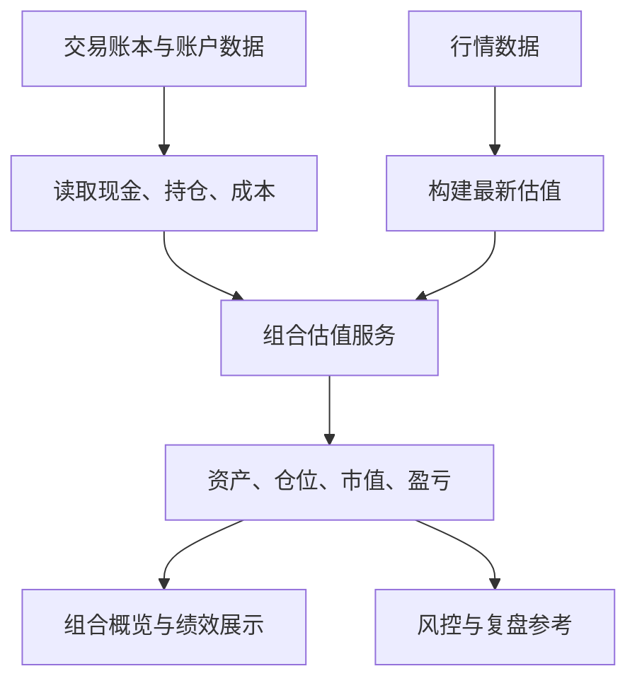

# 组合与绩效分析：从单次判断走向长期表现

仓库地址：[https://github.com/MarvekG/BestAITrader](https://github.com/MarvekG/BestAITrader)

> 组合与绩效分析把账户、现金、持仓、行情、成本和交易结果统一起来，帮助用户从资产视角评估 AI 决策的长期影响和组合风险。

## 为什么需要这个功能

投资不是一次判断，而是一系列决策的累积。某一次 AI 分析看起来合理，并不代表整体账户表现稳健。用户真正需要关注的是组合风险、资金利用、持仓集中度、盈亏来源、回撤压力和长期策略表现。

如果没有组合视角，交易结果就会被拆成孤立记录。用户只能看到单只股票涨跌，却很难理解这些决策如何共同影响账户，也很难判断 AI 决策流程是否在整体层面创造了稳定价值。

天枢智投通过组合与绩效分析，把单次交易放回整体账户中观察，让用户从“这次判断对不对”进一步看到“这套决策流程是否站得住”。

## 这个功能是什么

组合与绩效分析是天枢智投的账户表现层。它基于账户、现金、持仓、行情和成本构建组合估值，为前端组合概览、绩效评估、风险控制和经验复盘提供一致语义。

它不直接创建订单，也不替代风控或复盘，而是负责把当前账户状态和派生指标组织成稳定视图。它是交易账本向管理视角的上层抽象，让账户不只是数据记录，而是可观察、可分析、可复盘的组合实体。

## 它如何工作

1. 系统读取账户、现金、持仓、成本、成交和交易记录。
2. 系统结合最新行情构建组合估值，并识别行情缺失或估值降级状态。
3. 估值服务计算资产、仓位、市值、浮盈浮亏、已实现盈亏和相关派生指标。
4. 前端展示组合概览和绩效信息，让用户看到账户层面的整体变化。
5. 风控和经验复盘可复用一致的账户与持仓语义，避免不同模块各算一套。
6. 长期使用后，组合视角可以帮助用户评估策略是否稳定、风险是否集中、现金是否合理。

## 核心价值

- 组合化视角：用户不只看单只股票涨跌，而是观察决策对整体账户的影响。
- 估值口径统一：组合展示、风控、绩效和复盘共享同一套账户与持仓语义。
- 长期表现评估：用户可以持续观察资产变化和交易结果，评估 AI 决策流程是否稳定。
- 风险结构透明：仓位、集中度、现金和持仓市值能够帮助用户更早识别组合层面的风险。
- 管理决策支撑：组合数据可以为调仓、降风险、复盘和策略修正提供基础。

## 典型使用场景

- 模拟账户概览
- 持仓市值和现金观察
- 浮动盈亏和已实现盈亏跟踪
- 策略表现评估
- 风控检查参考
- 经验复盘结果对照

## 与普通方案有什么不同

| 常见做法 | 天枢智投做法 |
| --- | --- |
| 只看单笔交易结果 | 从组合层面评估整体账户 |
| 页面各自计算估值 | 复用统一组合估值服务 |
| 持仓和绩效语义分散 | 与交易、风控、复盘共享语义 |
| 只展示当前数值 | 支持后续表现和复盘链路 |
| 忽略数据缺失状态 | 暴露行情缺失或估值降级信息 |

## 使用边界

组合与绩效分析用于模拟账户和研究场景。估值依赖行情数据完整性，行情缺失或延迟可能导致展示降级。该功能不直接执行订单，也不单独提供买卖建议，组合表现也不代表未来策略收益。

## 总结

如果说单股分析回答的是“这只股票怎么看”，那么组合与绩效分析回答的是“这些判断放到账户里表现如何，以及它们是否形成了可持续的组合结果”。

真正重要的不是某一次判断有多精彩，而是一套决策流程能否在组合中长期站得住。
