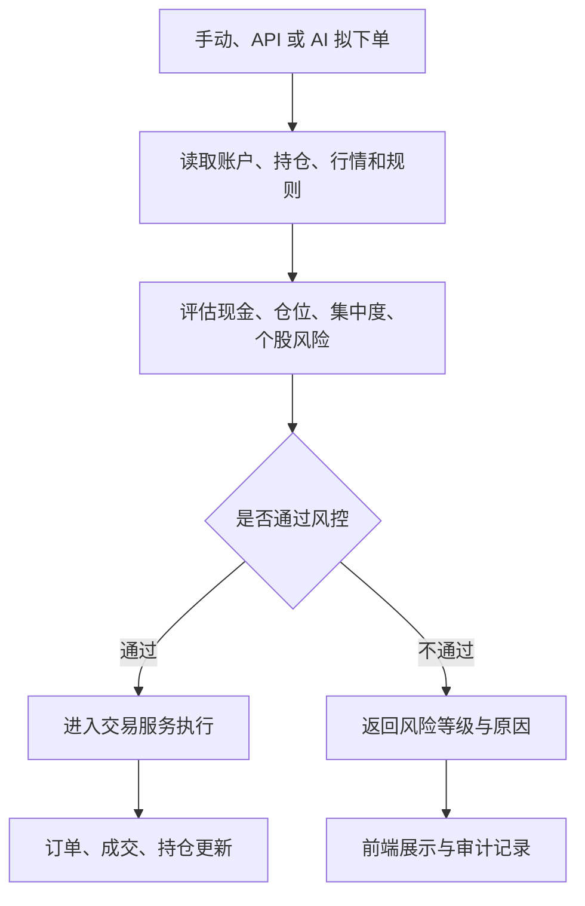

# 风险控制：让每一次交易都先经过纪律检验

仓库地址：[https://github.com/MarvekG/BestAITrader](https://github.com/MarvekG/BestAITrader)

> 风险控制在订单进入交易执行前评估现金、仓位、集中度和个股风险，让 AI、API 和手动交易遵守同一套可解释的纪律。

## 1. 为什么需要这个功能

只关注机会、不约束风险，是投资系统最危险的缺陷之一。尤其当 AI 能够生成充分的买入理由时，系统更需要稳定的风控机制，防止单一观点过度乐观导致仓位失控、集中度过高或现金安全垫不足。

真实交易需要先回答几个问题：现金是否足够，仓位是否过高，个股是否过度集中，交易是否违反规则，风险是否可解释。如果这些问题没有在执行前处理，后续复盘也很难判断错误来自策略判断、执行失误还是纪律缺失。

天枢智投把风险控制放在交易执行前，让每一次交易先经过纪律检验。它的目标不是消灭风险，而是让风险在执行前被看见、被解释、被记录。

## 2. 这个功能是什么

风险控制是面向组合和订单层面的预检能力。它基于账户、持仓、行情和配置规则，对拟下单请求进行评估，输出是否允许、风险等级和触发原因。

风控模块不直接执行订单，也不绕过交易服务。它负责解释风险和约束，最终执行仍由统一交易链路完成。这样的分工让风控既能独立表达风险判断，又不会破坏交易账本的一致性。

对于 AI 交易来说，这一点尤其关键：模型可以提出动作，但不能绕过账户、仓位和规则约束直接影响持仓。

## 3. 它如何工作

1. 用户、API 或 AI 生成拟下单请求。
2. 风控服务读取账户、现金、持仓、行情和规则配置。
3. 系统评估资金覆盖、仓位比例、持仓集中度、个股风险和规则阈值。
4. 风控返回允许或拦截结果，并给出风险等级和触发原因。
5. 通过的订单进入交易服务，不通过的订单进入前端提示和审计记录。
6. 后续复盘可以结合风控结果判断交易是否遵守纪律。

## 4. 核心价值

- 前置纪律：风险不等到事后复盘才讨论，而是在订单执行前先被评估。
- 入口一致：手动、API 和 AI 下单使用统一风控判断，不因调用来源不同而改变规则。
- 结果可解释：系统不仅返回是否允许，还说明触发了哪些风险规则，便于用户理解和审计。
- 保护组合边界：仓位、现金、集中度和个股风险检查可以降低单一交易对组合造成的冲击。
- 支撑复盘归因：风控结果可以帮助后续区分策略错误、执行问题和纪律问题。

## 5. 典型使用场景

- AI 交易前预检
- 手动下单风险检查
- 仓位纪律管理
- 持仓集中度控制
- 风险提示和审计
- 策略约束验证

## 6. 与普通方案有什么不同

| 常见做法 | 天枢智投做法 |
| --- | --- |
| 交易后才发现风险 | 订单执行前先做风险预检 |
| AI 交易绕过人工规则 | AI 和手动交易共用风控服务 |
| 只返回失败提示 | 返回风险等级和触发原因 |
| 风控和交易耦合 | 风控负责评估，交易服务负责执行 |
| 风控规则不可审计 | 风控原因可展示、可记录、可复盘 |

## 7. 使用边界

风险控制用于规则约束和风险提示，不保证避免所有亏损，也不构成投资建议。风控效果依赖规则配置、账户数据、行情数据和用户对风险边界的设定。规则过松或数据缺失都会影响风控效果。

## 8. 总结

如果说 AI 投研负责发现机会，那么风险控制负责回答“这个机会是否值得以当前仓位、现金和组合状态承担”。

好的 AI 投研不只会发现机会，更要在交易前先问风险是否可承受。
