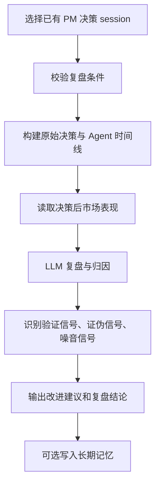

# 经验复盘：用真实走势检验 AI 判断

仓库地址：[https://github.com/MarvekG/BestAITrader](https://github.com/MarvekG/BestAITrader)

> 经验复盘把 PM 决策、Agent 时间线、交易执行和后验市场表现放在一起，归因成败、改进流程，并把高价值教训写入长期记忆。

## 1. 为什么需要这个功能

AI 生成一个投资结论并不难，真正困难的是在几天、几周或几个月之后回答：这个结论到底对不对，错在哪里，对在哪里，哪些经验下次还能复用。没有后验检验，AI 决策很容易停留在“当时看起来合理”的层面。

如果没有复盘，AI 投研就会停留在一次性输出。每次分析都像重新开始，错误没有被归因，成功经验没有被沉淀，流程问题也难以改进，长期看很难判断系统是否真的在变好。

天枢智投的经验复盘，让 AI 决策接受真实市场结果检验。它把“生成结论”推进到“验证结论、解释偏差、改进规则”的学习闭环。

## 2. 这个功能是什么

经验复盘是单股 AI 辩论后的后验评估系统。它不重新选股，也不重新跑普通分析，而是把已经产生 PM 决策的 debate session 与决策后的价格路径、相对表现、回撤、交易执行和 Agent timeline 放在一起复核。

复盘重点不是简单判断涨了还是跌了，而是分析原始判断中的哪些信号被验证、哪些被证伪、哪些属于噪音，PM 的仓位和止损是否合理，多空辩论是否遗漏了关键变量。

当系统提炼出可复用经验时，可以将经验写入长期记忆，让后续分析能够召回历史教训。这让天枢智投具备从历史结果中持续改进的能力。

## 3. 它如何工作

1. 用户或调度器选择已有 PM 决策的分析会话。
2. 系统校验 session 归属、PM 决策、历史消息和后验市场结果是否可用。
3. 系统构建原始决策、Agent timeline、订单、成交和执行摘要。
4. 系统读取决策后的收益、回撤、相对指数表现和行业相对表现。
5. 复盘 Agent 分析判断成败原因、被验证信号、被证伪信号和流程缺口。
6. 系统输出改进后的动作、仓位、止损、卖出规则或 debate 流程建议。
7. 高价值规则和教训可以写入长期记忆，用于后续分析召回。

## 4. 核心价值

- 后验检验：系统用真实价格路径和相对表现检验原始 PM 决策，而不是停留在主观评价。
- 主因归因：复盘会区分真正驱动涨跌的因素、被证伪信号和噪音信号。
- 流程改进：系统可以识别 debate 流程中的遗漏、仓位纪律问题和卖出设计问题。
- 决策校准：复盘结果可以帮助调整信心、仓位、止损和交易执行规则。
- 经验沉淀：可复用交易规则、失败教训和流程改进可以写入长期记忆。

## 5. 典型使用场景

- PM 决策后 5 日、20 日、60 日复盘
- AI 决策质量评估
- 涨跌主因归因
- 交易执行结果复核
- 仓位和止损规则优化
- 长期经验沉淀

## 6. 与普通方案有什么不同

| 常见做法 | 天枢智投做法 |
| --- | --- |
| 分析结束后不再追踪 | 决策后用真实市场结果复盘 |
| 只看涨跌结果 | 结合原始决策、Agent 观点和交易执行归因 |
| 复盘经验难复用 | 高价值经验可写入长期记忆 |
| 成败原因停留在主观总结 | 区分验证信号、证伪信号和噪音信号 |
| 只复盘结果不复盘流程 | 同时评估 PM 决策、辩论过程、仓位和执行设计 |

## 7. 使用边界

经验复盘基于历史结果做归因，不保证未来市场重复同样规律。复盘结论用于研究和流程改进，不构成投资建议，也不能替代用户独立判断。历史市场结果可能受偶然事件影响，复盘应结合样本数量和市场环境理解。

## 8. 总结

如果说 AI 决策解决的是“现在怎么判断”，那么经验复盘解决的是“这个判断后来被市场如何验证、偏差来自哪里，以及下次应该如何改进”。

让每一次 AI 判断都接受市场检验，让每一次成败都成为下一次进化的养分。
