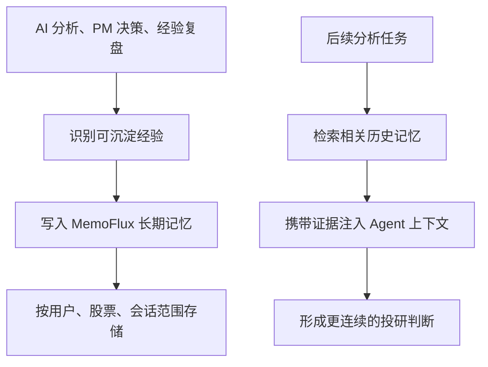

# 长期记忆：让 AI 记住历史、经验和偏好

仓库地址：[https://github.com/MarvekG/BestAITrader](https://github.com/MarvekG/BestAITrader)

> 长期记忆让天枢智投沉淀历史分析、复盘教训、用户偏好和股票经验，并在后续决策中以可审计方式召回，让 AI 投研具备连续性。

## 为什么需要这个功能

很多 AI 工具每次对话都像第一次见面。用户之前分析过什么、某只股票曾经有哪些风险、上一次判断错在哪里、用户偏好什么风格，这些信息如果无法沉淀，AI 就很难成为长期投研助手，只能反复执行低价值的上下文重建。

投研的价值往往来自积累。一次错误的仓位判断、一次被证伪的利好逻辑、一次成功的风险规避，如果不能进入后续上下文，就无法帮助系统进化。没有记忆，复盘也很难真正影响下一次决策。

天枢智投通过长期记忆，让 AI 投研具备连续性，让系统不只是“会分析”，还能够“带着历史经验分析”。

## 这个功能是什么

长期记忆是天枢智投连接历史经验和当前分析的能力。系统集成 MemoFlux，用于存储、召回和审计投研结论、复盘教训、交易规则和用户偏好。

主后端通过明确 HTTP 边界访问记忆服务，按用户、股票和会话范围隔离，避免把记忆变成不可控的全局混杂上下文。记忆召回不是简单相似文本检索，而是要服务于当前分析任务，并保留来源、证据和审计语义。

这使长期记忆成为经验复盘、个性化投研和持续学习的连接层。

## 它如何工作

1. AI 分析、PM 决策或经验复盘产生高价值结论、失败教训或规则建议。
2. 系统判断哪些经验值得写入长期记忆，避免把所有噪音都沉淀为经验。
3. 记忆服务按用户、股票和会话范围存储内容、证据和上下文。
4. 后续分析时，Agent 可以召回相关历史经验、用户偏好和股票特定教训。
5. 召回结果作为上下文进入新一轮分析，帮助 PM 更好地校准仓位、风险和判断口径。
6. 用户可以通过审计信息理解记忆从哪里来、为什么被召回。

## 核心价值

- 投研连续性：AI 不再每次从零开始，而是能参考历史判断和复盘结果。
- 个性化沉淀：用户偏好、策略风格和风险倾向可以逐步沉淀，影响后续分析上下文。
- 经验可复用：成功规则和失败教训可以在类似股票或类似场景中被召回。
- 审计更清晰：记忆不是模糊声称“我记得”，而是携带证据和上下文进入分析流程。
- 闭环学习：经验复盘写入记忆，后续分析再召回记忆，形成持续进化链路。

## 典型使用场景

- 同一股票的历史结论召回
- 用户偏好和风格沉淀
- 经验复盘教训复用
- 仓位和止损规则记忆
- 长期研究上下文补全
- AI 决策持续优化

## 与普通方案有什么不同

| 常见做法 | 天枢智投做法 |
| --- | --- |
| 每次分析互相割裂 | 历史结论和复盘教训可召回 |
| 上下文依赖用户重复输入 | 用户偏好和股票经验逐步沉淀 |
| 记忆来源不清 | 记忆召回携带证据和审计信息 |
| 复盘后经验无法进入下次分析 | 高价值经验可写回长期记忆 |
| 记忆全局混用 | 按用户、股票和会话范围隔离 |

## 使用边界

长期记忆用于辅助分析和上下文补全，不保证召回内容永远适用于当前市场。历史经验可能失效，用户应结合最新数据、市场环境和风险判断使用。记忆召回应被视为上下文参考，而不是自动交易依据。

## 总结

如果说普通 AI 工具解决的是“回答当前问题”，那么天枢智投的长期记忆解决的是“让历史经验、用户偏好和复盘教训参与下一次判断”。

真正的 AI 投研助手，不只会回答现在的问题，也能记住过去的教训。
