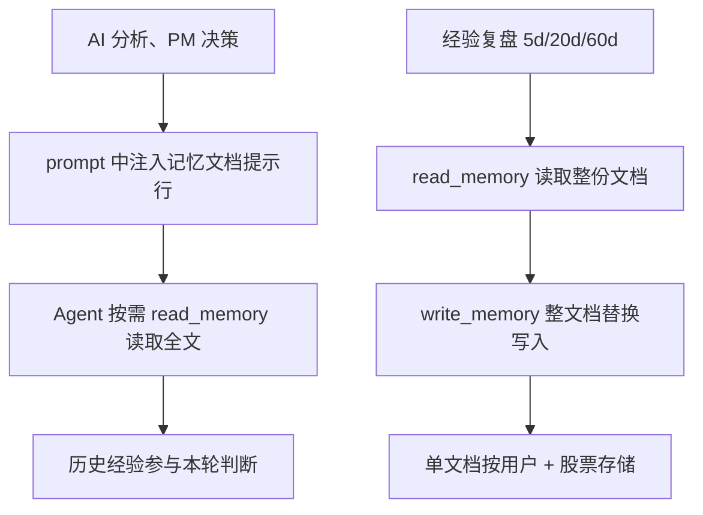

# 长期记忆：让 AI 记住历史、经验和偏好

仓库地址：[https://github.com/MarvekG/BestAITrader](https://github.com/MarvekG/BestAITrader)

> 长期记忆让天枢智投沉淀历史分析、复盘教训和股票经验，并在后续决策中按需读取，让 AI 投研具备连续性，同时控制 token 成本。

## 1. 为什么需要这个功能

很多 AI 工具每次对话都像第一次见面。用户之前分析过什么、某只股票曾经有哪些风险、上一次判断错在哪里，这些信息如果无法沉淀，AI 就很难成为长期投研助手，只能反复执行低价值的上下文重建。

投研的价值往往来自积累。一次错误的仓位判断、一次被证伪的利好逻辑、一次成功的风险规避，如果不能进入后续上下文，就无法帮助系统进化。没有记忆，复盘也很难真正影响下一次决策。

同时，如果把所有历史经验整块塞进每次决策的 prompt，token 成本会随记忆增长快速膨胀。天枢智投通过长期记忆，让 AI 投研既具备连续性，又不为记忆付出无谓的 token 代价。

## 2. 这个功能是什么

长期记忆是天枢智投连接历史经验和当前分析的能力。系统采用**单文档记忆**模型：一个用户和一只股票共同锚定一份 Markdown 记忆文档，所有复盘教训、决策对错、风控规则和流程改进都沉淀在这份文档里。

文档的结构不设固定模板，由 AI 在读写中自主组织：按时间排列经验、标注决策与复盘日期、合并过时内容、保留后验收益证据。记忆的读取是**按需**的：prompt 中只注入一行"文档存在"的提示，Agent 只有在历史经验确实可能影响判断时，才通过工具读取全文。

## 3. 它如何工作

```mermaid
flowchart TD
    A["AI 分析、PM 决策"] --> B["prompt 中注入记忆文档提示行"]
    E["经验复盘 5d/20d/60d"] --> F["read_memory 读取整份文档"]
    F --> G["write_memory 整文档替换写入"]
    G --> H["单文档按用户 + 股票存储"]
    B --> I["Agent 按需 read_memory 读取全文"]
    I --> J["历史经验参与本轮判断"]
```

1. Agent 的 prompt 中会出现一行记忆文档提示（文件是否存在、字符数、版本号），全文不进 prompt。
2. Agent 判断历史经验可能影响仓位、止损、置信度或执行计划时，调用 `read_memory` 读取整份文档。
3. 经验复盘工作流在决策后 5d/20d/60d 运行，读取文档、合并本次复盘的新教训后整文档替换写回。
4. 写入带乐观版本号校验：并行 Agent 同时写入时，后写者会收到版本冲突和最新全文，必须合并后重试，避免互相覆盖。
5. 文档有容量上限（默认 8000 字符，可通过 `MEMORY_DOC_MAX_CHARS` 调整），超限时 AI 必须先精炼合并旧内容再写入，记忆不会无限膨胀。

## 4. 核心价值

- 投研连续性：AI 不再每次从零开始，而是能参考历史判断和复盘结果。
- 成本可控：记忆全文按需读取，prompt 只常驻一行提示；文档容量有硬上限，token 成本不随历史增长失控。
- 结构自由：文档格式由 AI 自主演化，不需要预定义条目模型或检索 schema。
- 写入安全：版本号乐观锁防止并行写入互相覆盖；写入前必须先读取最新全文。
- 闭环学习：经验复盘整文档更新记忆，后续分析按需读取，形成持续进化链路。

## 5. 典型使用场景

- 同一股票的历史结论与后验结果对照
- 经验复盘教训复用
- 仓位和止损规则记忆
- 驱动因素被验证或证伪的历史记录
- AI 决策持续优化

## 6. 与普通方案有什么不同

| 常见做法 | 天枢智投做法 |
| --- | --- |
| 每次分析互相割裂 | 历史结论和复盘教训按需可读 |
| 记忆整块塞进 prompt，token 随历史膨胀 | prompt 只注入一行提示，全文按需读取 |
| 固定条目模型 + 向量检索，链路重 | 一份自由格式 Markdown 活文档，读写直达 |
| 并行写入互相覆盖 | 版本号乐观锁，冲突时返回最新全文强制合并 |
| 记忆无限增长 | 容量上限逼出精炼和合并 |

## 7. 使用边界

长期记忆用于辅助分析和上下文补全，不保证记载内容永远适用于当前市场。历史经验可能失效，Agent 和用户应结合最新数据、市场环境和风险判断使用。记忆内容应被视为上下文参考，而不是自动交易依据。

## 8. 总结

如果说普通 AI 工具解决的是"回答当前问题"，那么天枢智投的长期记忆解决的是"让历史经验和复盘教训以可控的成本参与下一次判断"。

真正的 AI 投研助手，不只会回答现在的问题，也能记住过去的教训。
