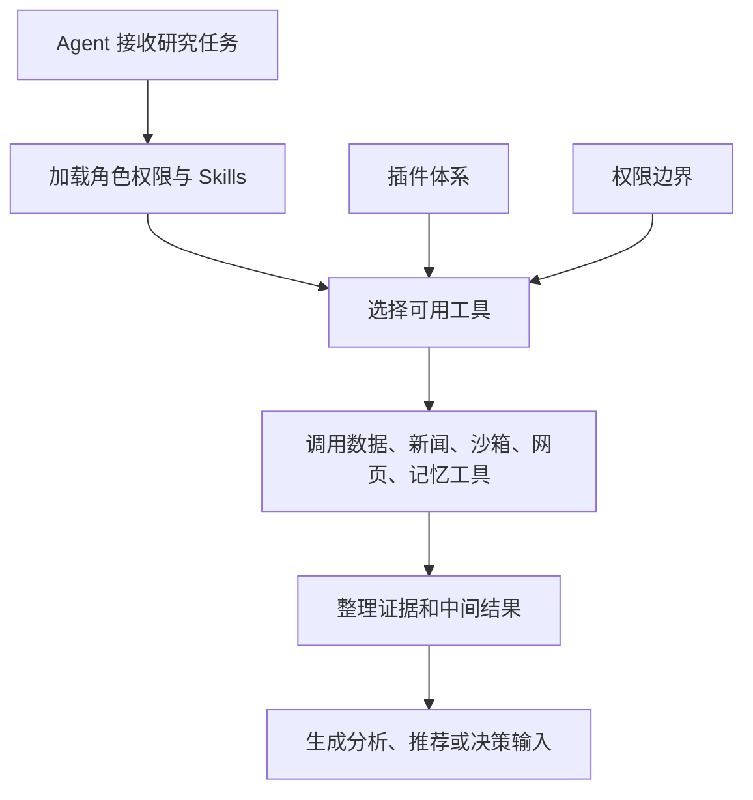

# Agent 工具、Skills 与插件：让 AI 从会说变成会做

仓库地址：[https://github.com/MarvekG/BestAITrader](https://github.com/MarvekG/BestAITrader)

> Agent 工具、Skills 与插件体系让 AI 能在受控边界内查数据、看新闻、跑沙箱、读网页、用记忆和加载专业能力，把模型从“会说”升级为“会执行研究流程”。

## 1. 为什么需要这个功能

只会生成文字的 AI，很难承担复杂投研任务。真实研究需要查行情、读新闻、看政策、算指标、跑脚本、检索网页、解析材料和整理证据。如果 AI 不能使用工具，它只能依赖模型已有知识和用户输入，能力边界很快会触顶，结论也容易停留在泛泛而谈。

但工具也不能无限开放。普通分析师不能绕过交易规则直接下单，新闻源不能随意写死，数据源不能各自实现一套采集框架，外部调用也需要清晰边界。否则系统会从“智能增强”变成“不可控自动化”。

天枢智投通过 Agent 工具、Skills 与插件体系，让 AI 在受控前提下扩展能力，既提高研究深度，又保留工程边界和安全边界。

## 2. 这个功能是什么

Agent 工具、Skills 与插件是天枢智投的智能体能力扩展层。它为 Agent 提供数据查询、新闻检索、政策分析、技术指标、资金流、Python 沙箱、网页抓取、PDF 解析、长期记忆和专业 Skills。

系统通过权限边界和插件规范管理工具使用，让 AI 能完成复杂研究，同时避免越权执行和重复造轮子。新闻源通过插件体系接入，数据源通过 ingestor 插件接入，专业方法通过 Skills 沉淀，交易工具只在 PM 阶段暴露。

这套体系让天枢智投具备持续扩展能力：新增数据源、新闻源、分析方法和工具能力时，不需要推翻现有工作流。

## 3. 它如何工作

1. Agent 根据角色、任务阶段和系统配置加载可用工具与 Skills。
2. 系统根据权限限制工具范围，避免普通 Agent 越权操作或直接下单。
3. Agent 在推理过程中调用数据、新闻、沙箱、网页、PDF 和记忆工具。
4. 工具结果被整理为证据，进入分析上下文或后续 Agent 阶段。
5. 新闻源、数据源和专业能力可以通过插件或 Skills 扩展。
6. 工具调用过程可以进入任务审计和调用历史，方便排障和复盘。

## 4. 核心价值

- 工具增强推理：AI 不只依赖模型记忆，而是可以查证据、算指标、检索信息后再形成结论。
- 权限边界清晰：不同 Agent 拥有不同工具权限，PM 才能在特定阶段接入交易工具。
- 扩展方式统一：新闻源、数据源和专业技能通过插件或 Skills 接入，避免新增平行体系。
- 研究能力沉淀：常用分析方法可以沉淀为 Skills，让复杂任务更容易复用和迭代。
- 工程可维护：工具、插件和 Skills 都有清晰职责，便于长期扩展而不破坏核心流程。

## 5. 典型使用场景

- Agent 调用行情和财务工具
- 新闻源插件扩展
- 专业投研 Skills 加载
- Python 沙箱计算
- 网页和 PDF 材料辅助分析
- 长期记忆读写

## 6. 与普通方案有什么不同

| 常见做法 | 天枢智投做法 |
| --- | --- |
| AI 只生成文字 | Agent 可以调用受控工具补全证据 |
| 工具调用散落在代码里 | 工具、Skills 和插件有明确边界 |
| 所有 Agent 权限相同 | 按角色限制工具使用范围 |
| 新数据源和新闻源难扩展 | 通过插件体系接入和验证 |
| 工具结果难以审计 | 工具调用可进入任务事件和调用历史 |

## 7. 使用边界

工具调用依赖外部数据源、新闻源、网页服务和模型服务的可用性。系统不提交真实 API key 或授权数据，用户接入外部服务前需要自行确认服务条款、缓存限制和再分发限制。工具增强能提升证据覆盖，但不能保证外部信息完整、及时或完全准确。

## 8. 总结

如果说普通 AI 工具解决的是“生成文本”，那么天枢智投的 Agent 工具体系解决的是“让 AI 在受控流程里查证据、用工具、沉淀能力，并完成可审计的研究任务”。

让 AI 不只会说观点，更会查证据、用工具、按流程完成研究。
