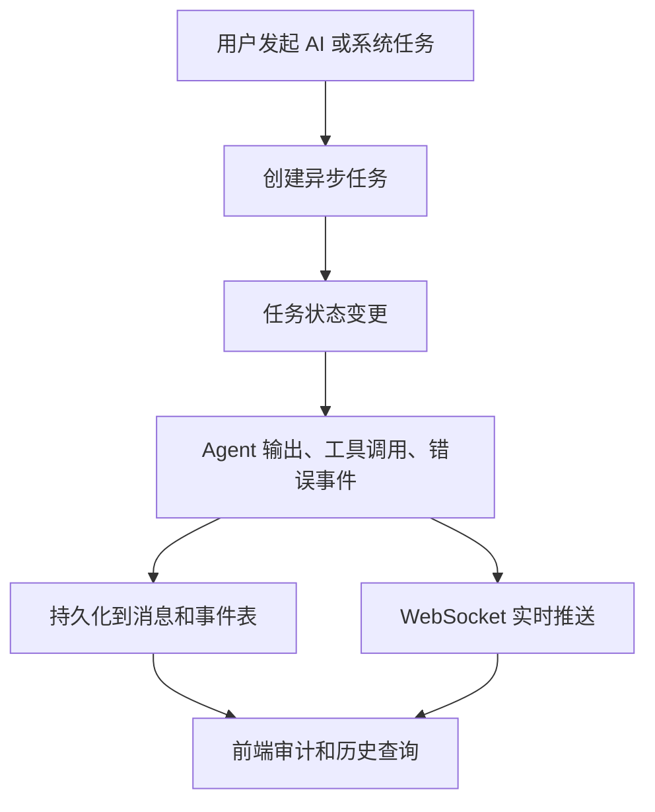

# 实时任务与过程审计：让 AI 每一步都看得见

仓库地址：[https://github.com/MarvekG/BestAITrader](https://github.com/MarvekG/BestAITrader)

> 实时任务与过程审计通过异步任务、WebSocket、消息持久化和前端视图，让 AI 分析、选股、交易和复盘过程可看、可查、可回放。

## 1. 为什么需要这个功能

AI 系统最容易让人不放心的地方，是黑箱。用户点击开始，等待一段时间，系统给出一个结论，但中间发生了什么、用了哪些信息、哪个环节失败、为什么得出这个判断，常常难以追踪。对于投研系统来说，这种不透明会直接削弱信任。

在投研和交易场景里，结论不能脱离过程。新闻分析是否引用了有效信息，风控是否指出关键风险，多空辩论是否充分，PM 是否处理了事实冲突，工具调用是否失败，这些都直接影响用户对结果的信任。

天枢智投把 AI 工作流设计成可观测、可审计的任务过程，让用户不仅看到“最后说了什么”，也能看到“系统如何一步步走到这里”。

## 2. 这个功能是什么

实时任务与过程审计是天枢智投的可观测能力。它通过异步任务管理、WebSocket 推送、数据库消息记录和前端审计页面，展示 AI 分析、选股、复盘、交易和系统任务的运行状态。

它让用户不仅能看到最终结果，也能看到结果是怎样一步步生成的。对于开发者，它也是排查模型调用、工具异常、数据缺失和任务失败的重要入口；对于用户，它是建立 AI 决策信任的基础。

## 3. 它如何工作

1. 用户发起 AI 分析、选股、复盘或交易相关任务。
2. 后端创建异步任务并更新运行状态，避免长任务阻塞普通请求。
3. Agent 输出、工具调用、阶段变化和异常事件被记录。
4. 系统通过 WebSocket 向前端实时推送进展，用户可以看到任务正在发生什么。
5. 前端展示任务状态、消息流、Agent 输出和审计信息。
6. 历史记录可用于回放、排障、复盘和过程审计。

## 4. 核心价值

- 过程透明：用户可以看到任务处于哪个阶段、哪个 Agent 输出了什么、是否发生异常。
- 结果可回放：关键消息、事件和状态被持久化，方便后续复查和审计。
- 排障效率高：模型调用失败、数据源异常、工具超时和工作流中断都能更快定位。
- 信任基础强：投研决策不仅有结论，还有过程证据和角色输出作为支撑。
- 支撑工程化运行：异步任务和事件记录让复杂 AI 工作流更适合长期运行和维护。

## 5. 典型使用场景

- AI 单股分析过程展示
- 选股研究消息流
- 经验复盘事件追踪
- 交易和持仓变化推送
- 系统异步任务监控
- 异常排查和审计回放

## 6. 与普通方案有什么不同

| 常见做法 | 天枢智投做法 |
| --- | --- |
| 用户只能等待最终结果 | 实时展示任务阶段和消息流 |
| 失败原因模糊 | 保存错误、工具调用和状态事件 |
| 结论难以回放 | 持久化 session、message、task 和事件 |
| AI 过程黑箱 | Agent 输出和流程节点可审计 |
| 长任务阻塞体验 | 异步任务和 WebSocket 分离执行与展示 |

## 7. 使用边界

实时审计依赖任务事件、WebSocket 连接和前端展示状态。网络中断或服务异常可能影响实时推送，但持久化记录可以用于后续查询。审计记录用于辅助理解流程，不代表结果一定正确，也不能替代对数据和结论的独立验证。

## 8. 总结

如果说普通 AI 系统只展示“最终答案”，那么天枢智投的实时任务与过程审计展示的是“答案形成、工具调用、异常处理和结果落库的全过程”。

可信 AI 不只要有结论，更要让每一步推理和执行都能被看见。
