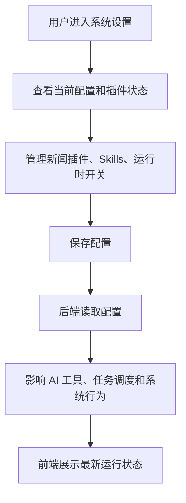

# 系统设置：把复杂能力收敛到可管理配置

仓库地址：[https://github.com/MarvekG/BestAITrader](https://github.com/MarvekG/BestAITrader)

> 系统设置集中管理新闻插件、Skills、运行时开关和系统配置，让复杂 AI 投研能力可以按环境、权限和业务需求灵活调整。

## 1. 为什么需要这个功能

完整的 AI 投研系统涉及模型路由、新闻插件、Skills、数据源、任务调度、自动化开关和运行时策略。如果这些能力都只能通过改代码调整，系统很难长期使用，也不适合私有化部署、团队协作和持续运维。

不同用户和团队拥有不同的数据源授权、模型代理配置、新闻服务、研究习惯和运维约束。一个固定配置的系统，很难适应这些差异，也难以在安全和灵活之间取得平衡。

天枢智投通过系统设置，把运行时能力收敛到可管理的配置入口，让平台能力既可扩展，又不失控。

## 2. 这个功能是什么

系统设置是天枢智投的运行时配置和扩展管理入口。它用于管理新闻插件、Skills、系统开关和相关配置，让用户在不修改核心代码的情况下调整系统能力。

它不是简单参数页，而是面向私有部署、能力扩展和系统运维的管理面板。通过系统设置，用户可以更清楚地知道当前系统启用了哪些能力、哪些插件可用、哪些自动化流程正在运行。

## 3. 它如何工作

1. 用户在系统设置页查看当前运行配置、插件状态和可用能力。
2. 用户管理新闻插件、Skills、自动化任务和系统开关。
3. 配置保存后进入后端统一配置体系，避免配置散落在业务代码里。
4. AI 工具、任务调度和运行时能力根据配置生效。
5. 前端展示最新配置状态和可用能力，方便用户和运维人员确认系统行为。
6. 当配置变化影响外部服务或插件能力时，用户可以结合调用历史和任务审计排查问题。

## 4. 核心价值

- 运维更集中：常用运行时能力可以在统一入口管理，减少直接改代码或改配置文件的成本。
- 私有化适配强：不同环境可以按自己的模型、新闻源、数据源和自动化要求调整系统。
- 扩展能力清晰：插件、Skills 和开关集中展示，用户更容易理解系统启用了哪些能力。
- 核心边界稳定：配置管理不破坏核心代码边界，避免把运行时差异散落到业务逻辑里。
- 更适合团队协作：配置状态可见，降低多人维护复杂系统时的沟通成本。

## 5. 典型使用场景

- 新闻插件管理
- Skills 启用和维护
- 自动化任务开关配置
- 私有部署环境适配
- 运行时能力排查
- 系统运维管理

## 6. 与普通方案有什么不同

| 常见做法 | 天枢智投做法 |
| --- | --- |
| 配置散落在代码和环境变量里 | 运行时能力集中到系统设置 |
| 插件启用状态不透明 | 前端展示插件和配置状态 |
| 私有化适配依赖改代码 | 通过配置和插件调整能力 |
| 扩展能力难管理 | Skills、插件和开关有统一入口 |
| 配置变化难排查 | 可结合任务审计和调用历史定位影响 |

## 7. 使用边界

系统设置用于管理运行时能力，不应写入真实 API key、Cookie、JWT 或其他敏感凭证。涉及第三方服务配置时，用户需要自行确认授权、用量和安全边界。生产环境还需要配合权限控制、密钥管理和部署安全策略。

## 8. 总结

如果说复杂 AI 投研系统需要很多能力开关，那么天枢智投的系统设置解决的是“把这些能力放到清晰、可管理、可扩展、可运维的入口中”。

复杂能力不应该散落在代码里，天枢智投把扩展和配置交给统一的系统设置管理。
