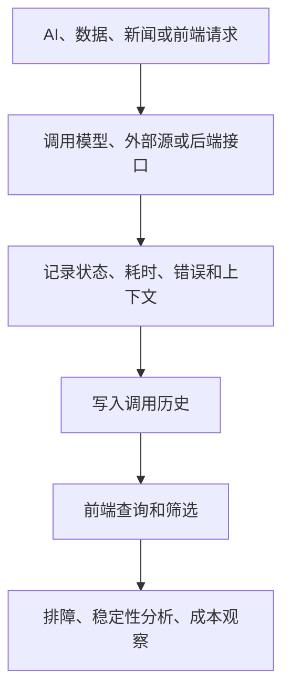

# API 调用历史：让系统运行状态有迹可查

仓库地址：[https://github.com/MarvekG/BestAITrader](https://github.com/MarvekG/BestAITrader)

> API 调用历史记录模型、数据源、新闻服务、工具和后端接口的调用情况，帮助用户观察稳定性、排查异常、理解依赖链路和控制成本。

## 为什么需要这个功能

AI 投研系统会频繁调用模型、数据源、新闻服务、搜索工具和后端接口。调用链路越复杂，越需要知道每一次请求发生了什么：是否成功、耗时多少、是否异常、成本是否异常增长、哪个环节最不稳定。

当一次 AI 分析结果不完整时，问题可能不在模型本身，而在数据源缺失、新闻检索失败、外部接口超时、工具返回异常或后端接口响应异常。如果没有调用历史，用户只能在黑箱中猜测。

天枢智投通过 API 调用历史，为复杂系统提供运行可观测性，让外部依赖和内部接口都成为可追踪、可分析、可优化的对象。

## 这个功能是什么

API 调用历史是面向系统运行过程的审计和排障能力。它记录关键调用的请求、响应、状态、耗时、错误和相关上下文，帮助用户和开发者理解外部依赖与后端接口的实际表现。

它关注的不是投研结论本身，而是支撑这些结论的调用链路是否可靠。对于依赖 LLM、新闻、搜索和金融数据的系统来说，调用历史是判断稳定性、定位瓶颈和控制资源消耗的基础。

## 它如何工作

1. 系统发起模型、数据源、新闻服务、工具或后端接口调用。
2. 调用过程记录状态、耗时、错误、调用来源和必要上下文。
3. 调用历史进入可查询记录，便于按接口、任务、时间或状态筛选。
4. 用户可以在前端查看历史调用，理解系统在某次任务中依赖了哪些服务。
5. 开发者可据此定位失败模式、慢调用、外部依赖波动和资源消耗问题。
6. 运维人员可以结合调用历史优化配置、替换插件或调整任务频率。

## 核心价值

- 快速排障：当 AI 分析异常时，可以追踪是模型、数据、新闻、工具还是后端接口出了问题。
- 稳定性观察：通过调用成功率、耗时和错误类型，识别不稳定外部依赖。
- 成本意识：模型、搜索和外部接口调用可能产生成本，历史记录有助于观察用量和异常增长。
- 审计支撑：关键调用有迹可查，方便回看系统在某次任务中依赖了哪些服务。
- 优化依据：调用历史可以帮助团队决定是否调整模型、替换数据源、优化插件或降低任务频率。

## 典型使用场景

- 模型调用排障
- 外部数据源失败分析
- 新闻插件稳定性观察
- 后端接口异常定位
- 调用耗时和瓶颈分析
- 资源消耗和成本观察

## 与普通方案有什么不同

| 常见做法 | 天枢智投做法 |
| --- | --- |
| 调用失败只看到最终错误 | 查看具体调用状态和错误信息 |
| 外部依赖问题难定位 | 区分模型、数据、新闻和后端接口问题 |
| 成本和耗时不可见 | 记录调用耗时和相关上下文 |
| 系统运行黑箱 | 调用链路有历史记录可审计 |
| 性能优化靠猜测 | 基于慢调用和失败模式做优化 |

## 使用边界

API 调用历史用于排障和观察，不应保存真实密钥、Cookie、JWT 或敏感账户数据。记录内容需要在可审计性和安全性之间保持边界，生产环境应根据隐私和合规要求控制日志保留范围。

## 总结

如果说 AI 投研结果依赖复杂调用链路，那么 API 调用历史解决的是“这些调用是否可靠、哪里失败、成本和耗时是否可控，以及系统应该从哪里优化”。

复杂系统需要可观测性，API 调用历史让每一次请求都有迹可查。
