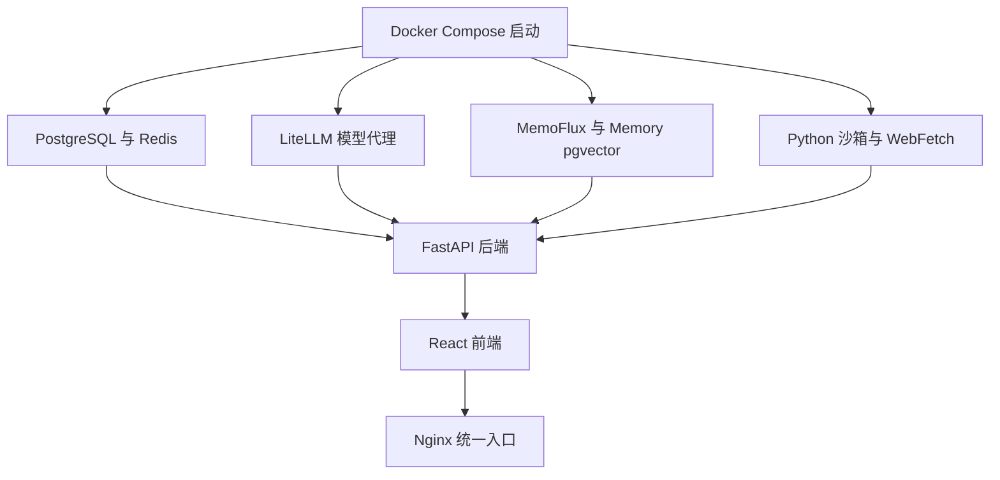

# 一体化部署：把完整 AI 投研系统一次拉起

仓库地址：[https://github.com/MarvekG/BestAITrader](https://github.com/MarvekG/BestAITrader)

> 一体化部署通过 Docker Compose 启动数据库、缓存、模型代理、长期记忆、沙箱、网页抓取、后端、前端和统一入口，让完整 AI 投研链路可落地、可演示、可二次开发。

## 为什么需要这个功能

很多 AI 原型可以用一个脚本跑起来，但真正可用的投研系统远不止一次模型调用。它需要数据库、缓存、模型代理、长期记忆、沙箱执行、网页抓取、后端服务、前端界面和统一网关，还需要这些组件之间有稳定边界。

如果每个组件都手动安装和配置，部署门槛会迅速升高。开发者难以复现环境，用户难以体验完整流程，团队也很难围绕同一套系统协作。复杂度会停留在“能不能跑起来”，而不是进入“如何改进投研能力”。

天枢智投通过 Docker Compose 一体化部署，把完整系统能力组织成可启动、可验证、可维护的工程环境，让 AI 投研从 demo 形态走向平台化运行。

## 这个功能是什么

一体化部署是天枢智投的工程化落地能力。完整部署会启动 PostgreSQL、Redis、LiteLLM、MemoFlux、Memory pgvector、独立 Python 沙箱、网页抓取服务、FastAPI 后端、React 前端和 Nginx 统一入口。

它让天枢智投不只是代码仓库，而是一套可运行的 AI 投研平台。用户可以在统一环境中体验数据管理、AI 分析、智能选股、模拟交易、长期记忆和经验复盘，而不是只运行某个孤立模块。

## 它如何工作

1. 用户通过 Docker Compose 启动完整服务栈。
2. 数据库、缓存、模型代理、记忆服务、沙箱服务和网页抓取服务先后就绪。
3. 后端连接基础设施，提供 API、任务调度、AI 工作流、交易、组合和复盘能力。
4. 前端连接后端，展示数据管理、AI 分析、选股、交易、设置和复盘页面。
5. Nginx 提供统一访问入口，方便本地体验、团队演示和服务器部署。
6. 开发者可以围绕标准服务边界进行调试、扩展插件和替换外部能力。

## 核心价值

- 启动成本低：用户不需要逐个手动安装服务，可以用 Compose 拉起完整系统。
- 链路完整：数据、AI、交易、记忆、沙箱和前端都在同一部署结构中协同运行。
- 私有化友好：团队可以在本地或服务器环境中部署自己的研究系统。
- 二次开发清晰：服务边界清楚，开发者可以围绕后端、前端、数据源、插件和模型代理扩展。
- 演示体验完整：部署后可以展示从数据到 AI 决策、模拟交易和经验复盘的全流程。

## 典型使用场景

- 本地研究环境启动
- 团队内部演示
- 私有化部署验证
- 开发调试环境搭建
- AI 投研系统二次开发
- Release 功能体验

## 与普通方案有什么不同

| 常见做法 | 天枢智投做法 |
| --- | --- |
| 单脚本或单服务 demo | 多服务组成完整投研系统 |
| 手动安装依赖复杂 | Docker Compose 统一启动 |
| 前后端和基础设施割裂 | 数据库、模型代理、记忆、沙箱、后端和前端协同部署 |
| 难以复现环境 | 部署结构可版本化和文档化 |
| 只能体验局部功能 | 可体验数据、AI、交易、记忆和复盘闭环 |

## 使用边界

一体化部署降低启动成本，但生产环境仍需要用户自行收紧安全配置、管理密钥、配置备份、监控服务和确认第三方数据授权。项目不附带真实行情、新闻、搜索或金融数据授权，也不会替代生产级运维、合规和安全审查。

## 总结

如果说 AI 原型解决的是“能不能跑一次”，那么天枢智投的一体化部署解决的是“能不能把完整系统持续运行起来，并支撑演示、研究和二次开发”。

天枢智投不是一个孤立 demo，而是一套可以通过 Compose 拉起的完整 AI 投研工程系统。
